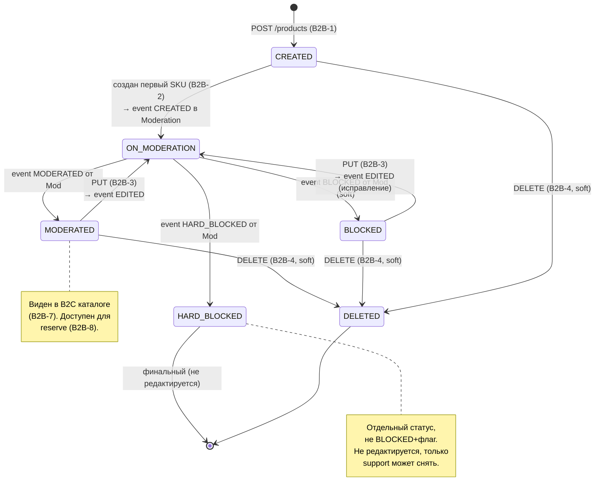
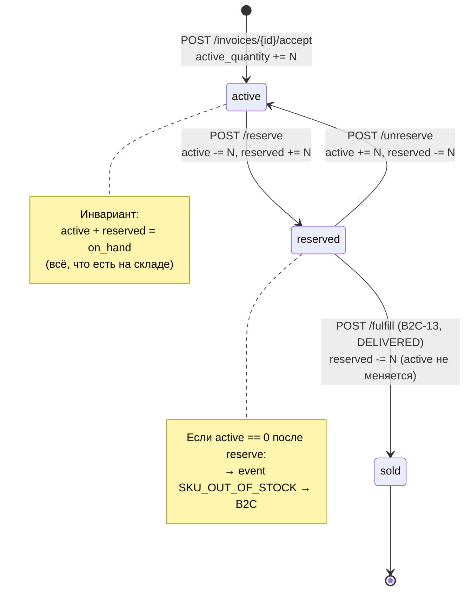
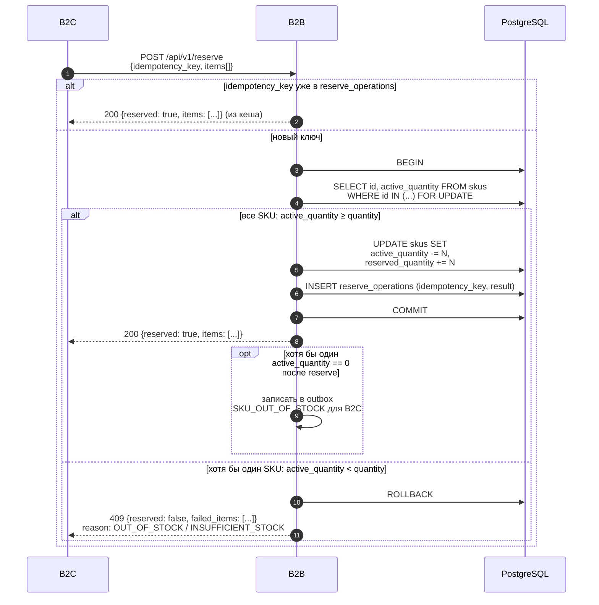

# B2B Flows -- User Flows кабинета продавца

Полное описание всех user flows модуля B2B. Для каждого flow: шаги пользователя, endpoint, request/response schema, валидация, побочные эффекты.

> **Соглашения**: все ID -- UUID (string, format: uuid). Цены -- integer в копейках. Все JSON-поля -- snake_case. Межсервисные вызовы требуют заголовок `X-Service-Key`. Ошибки -- формат `{"code": "...", "message": "..."}`.

---

<a name="create-product"></a>

## B2B-1: Создание товара

### Что происходит

Продавец заполняет карточку товара: название, описание, фото, категорию, характеристики товара. Товар создается со статусом `CREATED`. На модерацию **не отправляется** -- для этого нужен хотя бы один SKU (см. [B2B-2](#b2b-2-создание-sku)).

### Шаги продавца

1. Открыть раздел "Товары" в боковом меню
2. Нажать "Создать товар"
3. Заполнить форму: название, описание, загрузить фото, выбрать категорию из дерева, указать характеристики товара (бренд, страна)
4. Нажать "Сохранить"
5. Система создает товар и перенаправляет на шаг 2 -- добавление SKU

### Endpoint

```
POST /api/v1/products
```

### Request

```json
{
  "title": "iPhone 15 Pro Max",
  "description": "Флагманский смартфон Apple 2024 года с чипом A17 Pro",
  "category_id": "f47ac10b-58cc-4372-a567-0e02b2c3d479",
  "images": [
    {
      "url": "/s3/iphone15-front.jpg",
      "ordering": 0
    },
    {
      "url": "/s3/iphone15-back.jpg",
      "ordering": 1
    }
  ],
  "characteristics": [
    {
      "name": "Бренд",
      "value": "Apple"
    },
    {
      "name": "Страна-производитель",
      "value": "Китай"
    }
  ]
}
```

### Request Schema

| Поле | Тип | Обязательное | Описание |
|------|-----|:---:|----------|
| title | string | да | Название товара. 1-255 символов |
| description | string | да | Описание товара. 1-5000 символов |
| category_id | string (uuid) | да | ID категории из справочника |
| images | Image[] | да | Массив изображений, минимум 1 |
| images[].url | string (uri) | да | Ссылка на изображение в S3 |
| images[].ordering | integer | да | Порядок отображения (0 = главное фото) |
| characteristics | CharacteristicValue[] | нет | Характеристики товара (бренд, страна) |
| characteristics[].name | string | да | Название характеристики |
| characteristics[].value | string | да | Значение характеристики |

### Response 201

```json
{
  "id": "a1b2c3d4-e5f6-7890-abcd-ef1234567890",
  "title": "iPhone 15 Pro Max",
  "description": "Флагманский смартфон Apple 2024 года с чипом A17 Pro",
  "status": "CREATED",
  "deleted": false,
  "blocked": false,
  "category": {
    "id": "f47ac10b-58cc-4372-a567-0e02b2c3d479",
    "name": "iOS"
  },
  "images": [
    {
      "url": "/s3/iphone15-front.jpg",
      "ordering": 0
    },
    {
      "url": "/s3/iphone15-back.jpg",
      "ordering": 1
    }
  ],
  "characteristics": [
    {
      "name": "Бренд",
      "value": "Apple"
    },
    {
      "name": "Страна-производитель",
      "value": "Китай"
    }
  ],
  "skus": []
}
```

### Валидация и ошибки

| Ситуация | Код | Ответ |
|----------|-----|-------|
| Пустой title | 400 | `{"code": "INVALID_REQUEST", "message": "title is required"}` |
| title длиннее 255 | 400 | `{"code": "INVALID_REQUEST", "message": "title must be 1-255 characters"}` |
| category_id не существует | 400 | `{"code": "INVALID_REQUEST", "message": "Category not found"}` |
| Нет изображений | 400 | `{"code": "INVALID_REQUEST", "message": "At least one image is required"}` |
| Невалидный UUID | 400 | `{"code": "INVALID_REQUEST", "message": "category_id must be a valid UUID"}` |

### Побочные эффекты

Нет. Товар без SKU не отправляется на модерацию.

---

<a name="add-sku"></a>

## B2B-2: Создание SKU

### Что происходит

Продавец добавляет вариант товара (SKU): конкретная конфигурация с ценой, фото и характеристиками SKU (цвет, размер, объем памяти). Каждый SKU -- отдельная единица для продажи.

**Побочный эффект**: если это первый SKU для товара со статусом `CREATED`, товар автоматически переходит в `ON_MODERATION` и отправляется событие `CREATED` в Moderation.

### Шаги продавца

1. После создания товара (или на странице существующего товара) нажать "Добавить вариант"
2. Заполнить: название варианта, цену, себестоимость, скидку (опционально), загрузить фото, выбрать характеристики SKU (цвет, размер)
3. Нажать "Сохранить"
4. Если это первый SKU -- увидеть, что статус товара сменился на "На модерации"

### Endpoint

```
POST /api/v1/skus
```

### Request

```json
{
  "product_id": "a1b2c3d4-e5f6-7890-abcd-ef1234567890",
  "name": "256GB Black",
  "price": 12999000,
  "cost_price": 9500000,
  "discount": 0,
  "image": "/s3/iphone15-black-256.jpg",
  "characteristics": [
    {
      "name": "Цвет",
      "value": "Чёрный"
    },
    {
      "name": "Объём памяти",
      "value": "256 ГБ"
    }
  ]
}
```

### Request Schema

| Поле | Тип | Обязательное | Описание |
|------|-----|:---:|----------|
| product_id | string (uuid) | да | ID товара, к которому привязывается SKU |
| name | string | да | Название варианта. 1-255 символов |
| price | integer | да | Цена продажи в копейках. > 0 |
| cost_price | integer | да | Себестоимость в копейках. > 0 |
| discount | integer | нет | Абсолютная скидка в копейках. >= 0, по умолчанию 0 |
| image | string (uri) | да | Ссылка на фото SKU в S3 |
| characteristics | CharacteristicValue[] | нет | Характеристики SKU (цвет, размер, объем) |
| characteristics[].name | string | да | Название характеристики |
| characteristics[].value | string | да | Значение характеристики |

**Семантика discount**: абсолютная скидка в копейках. Если `price = 12999000` и `discount = 500000`, покупатель видит цену `12499000` (124 990.00 руб). Это НЕ процент.

### Response 201

```json
{
  "id": "b2c3d4e5-f6a7-8901-bcde-f12345678901",
  "product_id": "a1b2c3d4-e5f6-7890-abcd-ef1234567890",
  "name": "256GB Black",
  "price": 12999000,
  "cost_price": 9500000,
  "discount": 0,
  "image": "/s3/iphone15-black-256.jpg",
  "active_quantity": 0,
  "reserved_quantity": 0,
  "characteristics": [
    {
      "name": "Цвет",
      "value": "Чёрный"
    },
    {
      "name": "Объём памяти",
      "value": "256 ГБ"
    }
  ]
}
```

### Валидация и ошибки

| Ситуация | Код | Ответ |
|----------|-----|-------|
| product_id не существует | 404 | `{"code": "NOT_FOUND", "message": "Product not found"}` |
| Товар в статусе HARD_BLOCKED | 403 | `{"code": "FORBIDDEN", "message": "Cannot add SKU to hard-blocked product"}` |
| price <= 0 | 400 | `{"code": "INVALID_REQUEST", "message": "price must be a positive integer (kopecks)"}` |
| cost_price <= 0 | 400 | `{"code": "INVALID_REQUEST", "message": "cost_price must be a positive integer (kopecks)"}` |
| Пустой name | 400 | `{"code": "INVALID_REQUEST", "message": "name is required"}` |
| Нет image | 400 | `{"code": "INVALID_REQUEST", "message": "image is required"}` |

### Побочные эффекты

**Если это первый SKU для товара со статусом `CREATED`:**

1. Статус товара меняется: `CREATED` -> `ON_MODERATION`
2. Отправляется событие в Moderation:

```
POST {moderation_url}/api/v1/events/product
X-Service-Key: {b2b_to_mod_key}

{
  "idempotency_key": "d1e2f3a4-b5c6-7890-abcd-ef1234567890",
  "product_id": "a1b2c3d4-e5f6-7890-abcd-ef1234567890",
  "seller_id": "c3d4e5f6-a7b8-9012-cdef-123456789012",
  "event": "CREATED",
  "date": "2026-03-15T14:30:00.000Z"
}
```

**Если товар уже имеет SKU** -- SKU просто добавляется, статус не меняется, события не отправляются.

---

<a name="edit-product"></a>

## B2B-3: Редактирование товара/SKU

### Что происходит

Продавец редактирует карточку товара или один из SKU. Если товар был в статусе `MODERATED` или `BLOCKED`, он автоматически уходит на повторную модерацию.

### Шаги продавца

1. Открыть карточку товара
2. Изменить нужные поля (название, описание, фото, характеристики) или перейти к SKU и изменить его
3. Нажать "Сохранить"
4. Если товар был MODERATED -- увидеть смену статуса на "На модерации"

### Endpoint: изменение товара

```
PUT /api/v1/products/{id}
```

### Request (товар)

```json
{
  "title": "iPhone 15 Pro Max (обновлено)",
  "description": "Обновленное описание флагмана Apple",
  "category_id": "f47ac10b-58cc-4372-a567-0e02b2c3d479",
  "images": [
    {
      "url": "/s3/iphone15-front-v2.jpg",
      "ordering": 0
    }
  ],
  "characteristics": [
    {
      "name": "Бренд",
      "value": "Apple"
    }
  ]
}
```

Request schema аналогична B2B-1 (POST /products).

### Response 200 (товар)

Полный объект Product (аналогично response в B2B-1), с обновленными данными и актуальным `status`.

### Endpoint: изменение SKU

```
PUT /api/v1/skus/{id}
```

### Request (SKU)

```json
{
  "name": "256GB Black Titanium",
  "price": 13499000,
  "cost_price": 9800000,
  "discount": 500000,
  "image": "/s3/iphone15-black-titanium.jpg",
  "characteristics": [
    {
      "name": "Цвет",
      "value": "Чёрный титан"
    },
    {
      "name": "Объём памяти",
      "value": "256 ГБ"
    }
  ]
}
```

Request schema аналогична B2B-2 (POST /skus), без `product_id`.

### Авторизация (IDOR prevention)

**Ownership check**: извлечь `seller_id` из JWT claims.

- Для `PUT /products/{id}`: если `product.seller_id != jwt.seller_id` → 403 `{"code": "NOT_OWNER", "message": "Product does not belong to the authenticated seller"}`.
- Для `PUT /skus/{id}`: ownership проверяется через parent product. Если `sku.product.seller_id != jwt.seller_id` → 403 `NOT_OWNER`.

`seller_id` берётся **только из JWT claims**, никогда из body или query. Продавец не может изменить чужой товар/SKU, подменив `seller_id` в запросе.

### Валидация и ошибки

| Ситуация | Код | Ответ |
|----------|-----|-------|
| Товар/SKU не найден | 404 | `{"code": "NOT_FOUND", "message": "Product not found"}` / `{"code": "NOT_FOUND", "message": "SKU not found"}` |
| Товар/SKU принадлежит другому seller | 403 | `{"code": "NOT_OWNER", "message": "Product does not belong to the authenticated seller"}` |
| Товар HARD_BLOCKED | 403 | `{"code": "FORBIDDEN", "message": "Cannot edit hard-blocked product"}` |
| Невалидные данные | 400 | (см. валидацию B2B-1 / B2B-2) |

### Побочные эффекты

**Если товар в статусе `MODERATED`:**

1. Статус меняется: `MODERATED` -> `ON_MODERATION`
2. Отправляется событие `EDITED` в Moderation
3. Товар скрывается из каталога B2C (перестает отдаваться в GET /products с фильтром status=MODERATED)

**Если товар в статусе `BLOCKED`:**

1. Статус меняется: `BLOCKED` -> `ON_MODERATION`
2. Отправляется событие `EDITED` в Moderation
3. Товар попадает в очередь 2 модерации (исправленные после блокировки)

**Событие EDITED:**

```
POST {moderation_url}/api/v1/events/product
X-Service-Key: {b2b_to_mod_key}

{
  "idempotency_key": "e2f3a4b5-c6d7-8901-bcde-f23456789012",
  "product_id": "a1b2c3d4-e5f6-7890-abcd-ef1234567890",
  "seller_id": "c3d4e5f6-a7b8-9012-cdef-123456789012",
  "event": "EDITED",
  "date": "2026-03-15T16:45:12.000Z"
}
```

### Политика при активных резервах

Если на SKU товара есть активные резервы (reserved_quantity > 0):

- **Резервы остаются в силе** -- B2B не отменяет резервы. Заказ с зафиксированными ценами продолжает обрабатываться.
- **Товар скрывается из каталога** -- status != MODERATED, поэтому B2C не видит его в выборке.
- **Событие B2B->B2C не отправляется** -- это не блокировка и не удаление. B2C узнает о недоступности при следующем синхронном запросе GET.
- **Корзина**: при открытии покупатель увидит "Товар временно недоступен".
- **После повторной модерации**: если одобрен, товар снова появится в каталоге.

---

<a name="delete-product"></a>

## B2B-4: Удаление товара

### Что происходит

Продавец удаляет товар. Удаление мягкое: поле `deleted` устанавливается в `true`. Товар перестает отображаться в каталоге и в списке товаров продавца. Отправляются события в Moderation и B2C.

### Шаги продавца

1. Открыть карточку товара
2. Нажать "Удалить"
3. Подтвердить удаление
4. Товар исчезает из списка

### Endpoint

```
DELETE /api/v1/products/{id}
```

### Авторизация (IDOR prevention)

**Ownership check**: извлечь `seller_id` из JWT claims. Если `product.seller_id != jwt.seller_id` → 403 `{"code": "NOT_OWNER", "message": "Product does not belong to the authenticated seller"}`.

`seller_id` берётся **только из JWT claims**. Продавец не может удалить чужой товар.

### Response 200

```json
{
  "ok": true
}
```

### Валидация и ошибки

| Ситуация | Код | Ответ |
|----------|-----|-------|
| Товар не найден | 404 | `{"code": "NOT_FOUND", "message": "Product not found"}` |
| Товар принадлежит другому seller | 403 | `{"code": "NOT_OWNER", "message": "Product does not belong to the authenticated seller"}` |
| Товар уже удален | 400 | `{"code": "INVALID_REQUEST", "message": "Product already deleted"}` |

### Побочные эффекты

1. `deleted = true` в БД

2. Событие `DELETED` в Moderation:

```
POST {moderation_url}/api/v1/events/product
X-Service-Key: {b2b_to_mod_key}

{
  "idempotency_key": "f3a4b5c6-d7e8-9012-cdef-345678901234",
  "product_id": "a1b2c3d4-e5f6-7890-abcd-ef1234567890",
  "seller_id": "c3d4e5f6-a7b8-9012-cdef-123456789012",
  "event": "DELETED",
  "date": "2026-03-16T09:00:00.000Z"
}
```

3. Событие `PRODUCT_DELETED` в B2C:

```
POST {b2c_url}/api/v1/events/product
X-Service-Key: {b2b_to_b2c_key}

{
  "idempotency_key": "a4b5c6d7-e8f9-0123-abcd-456789012345",
  "event": "PRODUCT_DELETED",
  "product_id": "a1b2c3d4-e5f6-7890-abcd-ef1234567890",
  "sku_ids": [
    "b2c3d4e5-f6a7-8901-bcde-f12345678901",
    "c3d4e5f6-a7b8-9012-cdef-234567890123"
  ],
  "date": "2026-03-16T09:00:00.000Z"
}
```

4. B2C при получении `PRODUCT_DELETED`:
   - Удаляет (или помечает недоступными) `cart_items` с этими sku_ids
   - В `wishlist_items` показывает "Товар удален"

---

<a name="view-product"></a>

## B2B-5: Просмотр статуса и блокировки

### Что происходит

Продавец просматривает карточку товара. Видит текущий статус, а если товар заблокирован -- причину блокировки и замечания по конкретным полям.

### Product Lifecycle (state machine)



### Endpoint

```
GET /api/v1/products/{id}
```

### Авторизация (IDOR prevention)

Endpoint имеет два режима вызова:

1. **Seller cabinet** (Bearer JWT): извлечь `seller_id` из JWT claims. Продавец видит **только свои** товары. Если `product.seller_id != jwt.seller_id` → 404 `{"code": "NOT_FOUND", "message": "Product not found"}` (не 403 -- не раскрываем факт существования чужого товара).

2. **Исключение -- Moderation-сервис** (`X-Service-Key`): межсервисный вызов от Moderation (для получения `json_after` при diff). Видит **любые** товары любых продавцов, ownership не проверяется. B2C каталог использует отдельный режим со своими фильтрами видимости (см. [B2B-7](#b2b-7-endpoints-для-b2c-каталог)).

`seller_id` для seller-режима берётся **только из JWT claims**, никогда из body или query.

### Response 200

**Товар одобрен (MODERATED):**

```json
{
  "id": "a1b2c3d4-e5f6-7890-abcd-ef1234567890",
  "title": "iPhone 15 Pro Max",
  "description": "Флагманский смартфон Apple 2024 года",
  "status": "MODERATED",
  "deleted": false,
  "blocked": false,
  "category": {
    "id": "f47ac10b-58cc-4372-a567-0e02b2c3d479",
    "name": "iOS"
  },
  "images": [
    {
      "url": "/s3/iphone15-front.jpg",
      "ordering": 0
    }
  ],
  "characteristics": [
    {
      "name": "Бренд",
      "value": "Apple"
    }
  ],
  "skus": [
    {
      "id": "b2c3d4e5-f6a7-8901-bcde-f12345678901",
      "name": "256GB Black",
      "price": 12999000,
      "cost_price": 9500000,
      "discount": 0,
      "image": "/s3/iphone15-black-256.jpg",
      "active_quantity": 10,
      "reserved_quantity": 2,
      "characteristics": [
        {
          "name": "Цвет",
          "value": "Чёрный"
        },
        {
          "name": "Объём памяти",
          "value": "256 ГБ"
        }
      ]
    }
  ],
  "blocking_reason": null,
  "field_reports": []
}
```

**Товар заблокирован (BLOCKED):**

```json
{
  "id": "d4e5f6a7-b890-1234-cdef-567890123456",
  "title": "Levi's 501 Original",
  "description": "...",
  "status": "BLOCKED",
  "deleted": false,
  "blocked": true,
  "category": {
    "id": "e5f6a7b8-9012-3456-cdef-678901234567",
    "name": "Джинсы"
  },
  "images": [{"url": "/s3/levis-501.jpg", "ordering": 0}],
  "characteristics": [{"name": "Бренд", "value": "Levi's"}],
  "skus": [
    {
      "id": "f6a7b8c9-0123-4567-def0-789012345678",
      "name": "Размер 32",
      "price": 899000,
      "cost_price": 450000,
      "discount": 0,
      "image": "/s3/levis-501-32.jpg",
      "active_quantity": 0,
      "reserved_quantity": 0,
      "characteristics": [
        {"name": "Размер", "value": "32"}
      ]
    }
  ],
  "blocking_reason": {
    "id": "a7b8c9d0-1234-5678-ef01-890123456789",
    "title": "Описание не соответствует товару",
    "comment": "Несоответствие описания и фотографий"
  },
  "field_reports": [
    {
      "field_name": "description",
      "sku_id": null,
      "comment": "В описании указан материал 'натуральная кожа', на фото -- синтетика"
    },
    {
      "field_name": "sku_image",
      "sku_id": "f6a7b8c9-0123-4567-def0-789012345678",
      "comment": "Фото SKU не соответствует указанному цвету"
    }
  ]
}
```

### Response Schema (Product)

| Поле | Тип | Описание |
|------|-----|----------|
| id | string (uuid) | ID товара |
| title | string | Название |
| description | string | Описание |
| status | string (enum) | `CREATED`, `ON_MODERATION`, `MODERATED`, `BLOCKED`, `HARD_BLOCKED` |
| deleted | boolean | Мягкое удаление |
| blocked | boolean | Заблокирован модератором |
| category | object | `{id: uuid, name: string}` |
| images | Image[] | Фото товара |
| characteristics | CharacteristicValue[] | Характеристики товара |
| skus | SKU[] | Варианты товара |
| blocking_reason | object / null | Причина блокировки (при BLOCKED) |
| blocking_reason.id | string (uuid) | ID причины из справочника |
| blocking_reason.title | string | Текст причины |
| blocking_reason.comment | string | Комментарий модератора |
| field_reports | FieldReport[] | Замечания по полям (при BLOCKED) |

### SKU Schema (для seller cabinet, включает cost_price)

| Поле | Тип | Описание |
|------|-----|----------|
| id | string (uuid) | ID SKU |
| name | string | Название варианта |
| price | integer | Цена продажи в копейках |
| cost_price | integer | Себестоимость в копейках |
| discount | integer | Абсолютная скидка в копейках |
| image | string | URL фото SKU |
| active_quantity | integer | Доступный остаток на складе |
| reserved_quantity | integer | Зарезервировано (в заказах) |
| characteristics | CharacteristicValue[] | Характеристики SKU |

### FieldReport Schema

| Поле | Тип | Описание |
|------|-----|----------|
| field_name | string (enum) | `title`, `description`, `product_images`, `category`, `sku_name`, `sku_image`, `sku_price` |
| sku_id | string (uuid) / null | ID SKU (null если замечание к товару) |
| comment | string | Комментарий модератора |

### Валидация и ошибки

| Ситуация | Код | Ответ |
|----------|-----|-------|
| Товар не найден | 404 | `{"code": "NOT_FOUND", "message": "Product not found"}` |
| Невалидный UUID | 400 | `{"code": "INVALID_REQUEST", "message": "id must be a valid UUID"}` |

---

<a name="create-invoice"></a>

## B2B-6: Создание и приёмка накладной

### Что происходит

Продавец создает накладную -- документ на поставку товара на склад. Накладная содержит список SKU с количествами. Приёмка происходит через Django Admin (оператор склада). Возможна частичная приёмка.

### Шаги продавца

1. Открыть раздел "Накладные"
2. Нажать "Создать накладную"
3. Выбрать SKU из своих товаров (только со статусом MODERATED)
4. Указать количество для каждого SKU
5. Нажать "Отправить"

### Шаги оператора (Django Admin)

1. Открыть накладную в Django Admin
2. Для каждой позиции указать `accepted_quantity` (может быть меньше `quantity`)
3. Нажать "Принять"

### Endpoint: создание накладной

```
POST /api/v1/invoices
```

### Request

```json
{
  "items": [
    {
      "sku_id": "b2c3d4e5-f6a7-8901-bcde-f12345678901",
      "quantity": 10
    },
    {
      "sku_id": "c3d4e5f6-a7b8-9012-cdef-234567890123",
      "quantity": 5
    }
  ]
}
```

### Request Schema

| Поле | Тип | Обязательное | Описание |
|------|-----|:---:|----------|
| items | InvoiceItem[] | да | Позиции накладной. Минимум 1 |
| items[].sku_id | string (uuid) | да | ID SKU |
| items[].quantity | integer | да | Заявленное количество. > 0 |

### Авторизация (IDOR prevention)

**Ownership check**: извлечь `seller_id` из JWT claims. Для **каждого** `sku_id` в `items` проверить, что `sku.product.seller_id == jwt.seller_id`. Если хотя бы один SKU принадлежит другому продавцу → 403 `{"code": "NOT_OWNER", "message": "One or more SKUs do not belong to the authenticated seller"}`.

Проверка выполняется до создания накладной. Накладная -- документ на поставку, продавец не может поставить товар на SKU чужого продавца.

`seller_id` берётся **только из JWT claims**.

### Response 201

```json
{
  "id": "e5f6a7b8-9012-3456-cdef-678901234567",
  "status": "PENDING",
  "created_at": "2026-03-17T10:00:00.000Z",
  "items": [
    {
      "sku_id": "b2c3d4e5-f6a7-8901-bcde-f12345678901",
      "sku_name": "256GB Black",
      "quantity": 10,
      "accepted_quantity": null
    },
    {
      "sku_id": "c3d4e5f6-a7b8-9012-cdef-234567890123",
      "sku_name": "256GB White",
      "quantity": 5,
      "accepted_quantity": null
    }
  ]
}
```

### Валидация (создание)

| Ситуация | Код | Ответ |
|----------|-----|-------|
| Пустой items | 400 | `{"code": "INVALID_REQUEST", "message": "At least one item is required"}` |
| SKU не найден | 404 | `{"code": "NOT_FOUND", "message": "SKU not found"}` |
| SKU принадлежит другому seller | 403 | `{"code": "NOT_OWNER", "message": "One or more SKUs do not belong to the authenticated seller"}` |
| Товар не MODERATED | 400 | `{"code": "INVALID_REQUEST", "message": "Invoice can only be created for MODERATED products"}` |
| quantity <= 0 | 400 | `{"code": "INVALID_REQUEST", "message": "quantity must be > 0"}` |

---

### Endpoint: приёмка накладной

```
POST /api/v1/invoices/{id}/accept
```

Вызывается через Django Admin.

### Request

```json
{
  "items": [
    {
      "sku_id": "b2c3d4e5-f6a7-8901-bcde-f12345678901",
      "accepted_quantity": 10
    },
    {
      "sku_id": "c3d4e5f6-a7b8-9012-cdef-234567890123",
      "accepted_quantity": 3
    }
  ]
}
```

### Request Schema (приёмка)

| Поле | Тип | Обязательное | Описание |
|------|-----|:---:|----------|
| items | AcceptItem[] | да | Результат приёмки для каждой позиции |
| items[].sku_id | string (uuid) | да | ID SKU |
| items[].accepted_quantity | integer | да | Принятое количество. 0 <= accepted_quantity <= quantity |

### Response 200 (приёмка)

```json
{
  "id": "e5f6a7b8-9012-3456-cdef-678901234567",
  "status": "PARTIALLY_ACCEPTED",
  "created_at": "2026-03-17T10:00:00.000Z",
  "accepted_at": "2026-03-18T14:00:00.000Z",
  "items": [
    {
      "sku_id": "b2c3d4e5-f6a7-8901-bcde-f12345678901",
      "sku_name": "256GB Black",
      "quantity": 10,
      "accepted_quantity": 10
    },
    {
      "sku_id": "c3d4e5f6-a7b8-9012-cdef-234567890123",
      "sku_name": "256GB White",
      "quantity": 5,
      "accepted_quantity": 3
    }
  ]
}
```

### Логика определения статуса накладной

| Условие | Статус |
|---------|--------|
| Все `accepted_quantity == quantity` | `ACCEPTED` |
| Хотя бы один `accepted_quantity > 0`, но не все полностью | `PARTIALLY_ACCEPTED` |
| Все `accepted_quantity == 0` | `REJECTED` |

### Побочные эффекты (приёмка)

Для каждой позиции: `active_quantity` соответствующего SKU увеличивается на `accepted_quantity`.

```
SKU.active_quantity += accepted_quantity
```

Обновление `active_quantity` и статуса накладной должно происходить **в одной транзакции**.

---

<a name="catalog-for-b2c"></a>

## B2B-7: Endpoints для B2C (каталог)

### Что происходит

B2C-сервис запрашивает данные о товарах для витрины покупателя. Используется тот же endpoint `GET /api/v1/products`, но с фильтрами видимости. Также есть batch-запрос для подборок/избранного.

### Условие видимости товара для B2C

Товар отображается в каталоге только если **все** условия выполнены:
- `status = MODERATED`
- `deleted = false`
- хотя бы один SKU имеет `active_quantity > 0`

### Авторизация (IDOR prevention)

Endpoint для B2C **НЕ требует seller JWT** -- это публичный каталог (вызывается из B2C через `X-Service-Key`). Ownership-проверка здесь **не применима**: любой покупатель видит товары **любого** продавца.

Фильтрация происходит по условиям видимости (выше): `status = MODERATED`, `deleted = false`, `sum(skus.active_quantity) > 0`. Товар, принадлежащий любому seller, который удовлетворяет условиям, попадает в выдачу.

**Важно**: этот режим не должен быть доступен через Bearer JWT без `X-Service-Key` -- иначе обойти фильтр seller_id из B2B-11 (список товаров продавца) можно подменой заголовков. Разграничение по заголовкам реализуется в middleware/permissions.

### Endpoint: каталог с пагинацией

```
GET /api/v1/products
X-Service-Key: {b2c_to_b2b_key}
```

### Query Parameters

| Параметр | Тип | Обязательное | Описание |
|----------|-----|:---:|----------|
| limit | integer | нет | Размер страницы (по умолчанию 20, макс 100) |
| offset | integer | нет | Смещение (по умолчанию 0) |
| category | string (uuid) | нет | Фильтр по категории |
| search | string | нет | Текстовый поиск по title/description |
| sort | string (enum) | нет | Сортировка: `price_asc`, `price_desc`, `date_desc` |
| ids | string | нет | Batch-запрос: список UUID через запятую |

### Response 200

```json
{
  "items": [
    {
      "id": "a1b2c3d4-e5f6-7890-abcd-ef1234567890",
      "title": "iPhone 15 Pro Max",
      "description": "Флагманский смартфон Apple 2024 года",
      "status": "MODERATED",
      "category": {
        "id": "f47ac10b-58cc-4372-a567-0e02b2c3d479",
        "name": "iOS"
      },
      "images": [
        {"url": "/s3/iphone15-front.jpg", "ordering": 0}
      ],
      "characteristics": [
        {"name": "Бренд", "value": "Apple"}
      ],
      "skus": [
        {
          "id": "b2c3d4e5-f6a7-8901-bcde-f12345678901",
          "name": "256GB Black",
          "price": 12999000,
          "discount": 0,
          "image": "/s3/iphone15-black-256.jpg",
          "active_quantity": 10,
          "characteristics": [
            {"name": "Цвет", "value": "Чёрный"},
            {"name": "Объём памяти", "value": "256 ГБ"}
          ]
        }
      ]
    }
  ],
  "total_count": 42,
  "limit": 20,
  "offset": 0
}
```

**Важно**: SKU в ответе для B2C **НЕ содержит** `cost_price` и `reserved_quantity`. Эти поля -- только для seller cabinet.

### Batch-запрос

```
GET /api/v1/products?ids=a1b2c3d4-...,d4e5f6a7-...
X-Service-Key: {b2c_to_b2b_key}
```

Возвращает товары по списку ID. Используется B2C для отображения подборок и избранного. Условия видимости применяются: если товар не MODERATED или deleted -- он не попадет в ответ (а не вернет 404).

### Кто вызывает

| Вызывающий | Использование |
|------------|--------------|
| B2C | Каталог, поиск, карточка товара, подборки, избранное |
| Moderation | Получение json_after для diff-а (GET /products/{id}) |

---

<a name="reserve-sku"></a>

## B2B-8: Reserve / Unreserve

### Что происходит

При оформлении заказа B2C резервирует SKU, чтобы два покупателя не купили один и тот же остаток. При отмене заказа резерв снимается.

**Модель**: Lazy reserve -- корзина НЕ резервирует. Резерв только при оформлении заказа (checkout).

### SKU quantity state (инвариант)



### Reserve sequence (all-or-nothing)



### Endpoint: резервирование

```
POST /api/v1/reserve
X-Service-Key: {b2c_to_b2b_key}
```

### Request

```json
{
  "idempotency_key": "g1h2i3j4-k5l6-7890-mnop-qr1234567890",
  "items": [
    {
      "sku_id": "b2c3d4e5-f6a7-8901-bcde-f12345678901",
      "quantity": 2
    },
    {
      "sku_id": "c3d4e5f6-a7b8-9012-cdef-234567890123",
      "quantity": 1
    }
  ]
}
```

### Request Schema

| Поле | Тип | Обязательное | Описание |
|------|-----|:---:|----------|
| idempotency_key | string (uuid) | да | Защита от двойного резервирования |
| items | ReserveItem[] | да | Список SKU для резервирования |
| items[].sku_id | string (uuid) | да | ID SKU |
| items[].quantity | integer | да | Количество для резерва. > 0 |

### Response 200 (успех)

```json
{
  "reserved": true,
  "items": [
    {
      "sku_id": "b2c3d4e5-f6a7-8901-bcde-f12345678901",
      "reserved_quantity": 2,
      "remaining_stock": 8
    },
    {
      "sku_id": "c3d4e5f6-a7b8-9012-cdef-234567890123",
      "reserved_quantity": 1,
      "remaining_stock": 4
    }
  ]
}
```

### Response 409 (недостаточно остатков)

**All-or-nothing**: если хотя бы один SKU не может быть зарезервирован, вся операция отклоняется, ничего не резервируется.

```json
{
  "reserved": false,
  "failed_items": [
    {
      "sku_id": "c3d4e5f6-a7b8-9012-cdef-234567890123",
      "requested": 5,
      "available": 3,
      "reason": "INSUFFICIENT_STOCK"
    }
  ]
}
```

| reason | Описание |
|--------|----------|
| `OUT_OF_STOCK` | active_quantity = 0 |
| `INSUFFICIENT_STOCK` | active_quantity > 0, но < requested |

### Логика

Операция выполняется внутри транзакции с `SELECT FOR UPDATE` по задействованным SKU:

```sql
BEGIN;
SELECT id, active_quantity FROM skus
  WHERE id IN ('...', '...')
  FOR UPDATE;
-- Проверить, что active_quantity >= quantity для каждого SKU
-- Если хотя бы один не проходит -- ROLLBACK
UPDATE skus SET
  active_quantity = active_quantity - :quantity,
  reserved_quantity = reserved_quantity + :quantity
  WHERE id = :sku_id;
COMMIT;
```

### Идемпотентность

Если запрос с таким `idempotency_key` уже обработан успешно -- вернуть 200 с тем же результатом (не резервировать повторно).

```sql
CREATE TABLE reserve_operations (
    idempotency_key UUID PRIMARY KEY,
    result JSONB NOT NULL,
    created_at TIMESTAMP NOT NULL DEFAULT now()
);
```

### Побочные эффекты

- `SKU.active_quantity -= quantity`
- `SKU.reserved_quantity += quantity`
- Если `active_quantity` стал 0, отправляется событие `SKU_OUT_OF_STOCK` в B2C

---

### Endpoint: снятие резерва

```
POST /api/v1/unreserve
X-Service-Key: {b2c_to_b2b_key}
```

Компенсирующая транзакция при отмене заказа.

### Request

```json
{
  "order_id": "f6a7b8c9-0123-4567-def0-789012345678",
  "items": [
    {
      "sku_id": "b2c3d4e5-f6a7-8901-bcde-f12345678901",
      "quantity": 2
    },
    {
      "sku_id": "c3d4e5f6-a7b8-9012-cdef-234567890123",
      "quantity": 1
    }
  ]
}
```

### Request Schema

| Поле | Тип | Обязательное | Описание |
|------|-----|:---:|----------|
| order_id | string (uuid) | да | ID заказа в B2C (для идемпотентности) |
| items | UnreserveItem[] | да | Список SKU для снятия резерва |
| items[].sku_id | string (uuid) | да | ID SKU |
| items[].quantity | integer | да | Количество для снятия. > 0 |

### Response 200

```json
{
  "ok": true
}
```

### Логика

```sql
BEGIN;
SELECT id, reserved_quantity FROM skus
  WHERE id IN ('...', '...')
  FOR UPDATE;
UPDATE skus SET
  active_quantity = active_quantity + :quantity,
  reserved_quantity = reserved_quantity - :quantity
  WHERE id = :sku_id;
COMMIT;
```

### Побочные эффекты

- `SKU.active_quantity += quantity`
- `SKU.reserved_quantity -= quantity`

---

<a name="apply-moderation"></a>

## B2B-9: Обработка входящих событий от Moderation

### Что происходит

B2B получает результат модерации от Moderation-сервиса. Обновляет статус товара и при блокировке -- каскадно уведомляет B2C.

### Endpoint

```
POST /api/v1/events/moderation
```

Вызывается Moderation-сервисом.

### Request (одобрение)

```json
{
  "idempotency_key": "a4b5c6d7-e8f9-0123-defg-456789012345",
  "product_id": "a1b2c3d4-e5f6-7890-abcd-ef1234567890",
  "status": "MODERATED"
}
```

### Request (блокировка)

```json
{
  "idempotency_key": "b5c6d7e8-f9a0-1234-efgh-567890123456",
  "product_id": "a1b2c3d4-e5f6-7890-abcd-ef1234567890",
  "status": "BLOCKED",
  "hard_block": false,
  "blocking_reason": {
    "id": "a7b8c9d0-1234-5678-ef01-890123456789",
    "title": "Описание не соответствует товару",
    "comment": "Несоответствие описания и фотографий"
  },
  "field_reports": [
    {
      "field_name": "description",
      "sku_id": null,
      "comment": "Текст описания скопирован с другого товара"
    }
  ]
}
```

### Request Schema

| Поле | Тип | Обязательное | Описание |
|------|-----|:---:|----------|
| idempotency_key | string (uuid) | да | Ключ идемпотентности |
| product_id | string (uuid) | да | ID товара |
| status | string (enum) | да | `MODERATED` или `BLOCKED` |
| hard_block | boolean | при BLOCKED | `true` = перманентная блокировка |
| blocking_reason | object | при BLOCKED | Причина блокировки |
| field_reports | FieldReport[] | при BLOCKED | Замечания по полям |

### Логика обработки

**При status = MODERATED:**
1. Найти товар по `product_id`
2. Обновить: `status = MODERATED`, `blocked = false`
3. Очистить `blocking_reason` и `field_reports` (если были)
4. Ответить 200

**При status = BLOCKED, hard_block = false:**
1. Найти товар по `product_id`
2. Обновить: `status = BLOCKED`, `blocked = true`
3. Сохранить `blocking_reason` и `field_reports` для отображения продавцу
4. Отправить каскадное событие `PRODUCT_BLOCKED` в B2C
5. Ответить 200

**При status = BLOCKED, hard_block = true:**
1. Найти товар по `product_id`
2. Обновить: `status = HARD_BLOCKED`, `blocked = true`
3. Сохранить `blocking_reason`
4. Отправить каскадное событие `PRODUCT_BLOCKED` в B2C
5. Ответить 200

### Response

| Код | Значение |
|-----|----------|
| 200 | Событие принято и обработано |
| 400 | Невалидные данные |
| 404 | product_id не найден |

### Каскадное событие в B2C

При блокировке (мягкой или жёсткой) B2B отправляет в B2C:

```
POST {b2c_url}/api/v1/events/product
X-Service-Key: {b2b_to_b2c_key}

{
  "idempotency_key": "d7e8f9a0-b1c2-3456-ghij-789012345678",
  "event": "PRODUCT_BLOCKED",
  "product_id": "a1b2c3d4-e5f6-7890-abcd-ef1234567890",
  "sku_ids": [
    "b2c3d4e5-f6a7-8901-bcde-f12345678901",
    "c3d4e5f6-a7b8-9012-cdef-234567890123"
  ],
  "date": "2026-03-15T14:30:00.000Z"
}
```

---

<a name="fulfill-delivery"></a>

## B2B-10: Списание резерва при доставке (fulfill)

### Что происходит

Когда заказ переходит в статус DELIVERED, B2C вызывает fulfill для финального списания зарезервированного количества. Без этого `reserved_quantity` копится бесконечно.

### Endpoint

```
POST /api/v1/fulfill
X-Service-Key: {b2c_to_b2b_key}
```

### Request

```json
{
  "order_id": "f6a7b8c9-0123-4567-def0-789012345678",
  "items": [
    {
      "sku_id": "b2c3d4e5-f6a7-8901-bcde-f12345678901",
      "quantity": 2
    },
    {
      "sku_id": "c3d4e5f6-a7b8-9012-cdef-234567890123",
      "quantity": 1
    }
  ]
}
```

### Request Schema

| Поле | Тип | Обязательное | Описание |
|------|-----|:---:|----------|
| order_id | string (uuid) | да | ID заказа (для идемпотентности) |
| items | FulfillItem[] | да | Список SKU для списания |
| items[].sku_id | string (uuid) | да | ID SKU |
| items[].quantity | integer | да | Количество для списания. > 0 |

### Response 200

```json
{
  "ok": true
}
```

### Логика

```sql
BEGIN;
SELECT id, reserved_quantity FROM skus
  WHERE id IN ('...', '...')
  FOR UPDATE;
-- Проверить, что reserved_quantity >= quantity
UPDATE skus SET
  reserved_quantity = reserved_quantity - :quantity
  WHERE id = :sku_id;
COMMIT;
```

Идемпотентность: повторный вызов с тем же `order_id` -- 200 OK без изменений.

### Когда вызывается

B2C вызывает fulfill при переходе заказа в статус `DELIVERED` (через Django Admin). Это можно реализовать как:
- Django Admin action, который вызывает B2B API
- Или сигнал (post_save) на модели Order

---

<a name="list-products"></a>

## B2B-11: Список товаров продавца

### Что происходит

Продавец просматривает свои товары в seller cabinet. Список с фильтрацией по статусу и пагинацией.

### Endpoint

```
GET /api/v1/products
```

Тот же endpoint, что и для B2C (B2B-7), но **без X-Service-Key** (запрос от авторизованного продавца). B2B определяет seller_id из JWT-токена и фильтрует по нему.

### Авторизация (IDOR prevention)

**Автоматический фильтр по owner**: фильтр `WHERE seller_id = jwt.seller_id` применяется **автоматически** на уровне queryset (Django ORM / DRF permission). Продавец физически не может получить товары другого продавца, даже если передаст `seller_id` в query-параметрах -- такой параметр игнорируется.

`seller_id` берётся **только из JWT claims**, никогда из query или body. Query-параметры `seller_id` / `user_id` / `owner_id` -- игнорировать или возвращать 400 `INVALID_REQUEST` для явного сигнала клиенту.

### Query Parameters

| Параметр | Тип | Обязательное | Описание |
|----------|-----|:---:|----------|
| limit | integer | нет | Размер страницы (по умолчанию 20, макс 100) |
| offset | integer | нет | Смещение (по умолчанию 0) |
| status | string (enum) | нет | Фильтр: `CREATED`, `ON_MODERATION`, `MODERATED`, `BLOCKED`, `HARD_BLOCKED` |
| search | string | нет | Поиск по названию |

### Response 200

```json
{
  "items": [
    {
      "id": "a1b2c3d4-e5f6-7890-abcd-ef1234567890",
      "title": "iPhone 15 Pro Max",
      "status": "MODERATED",
      "category": {
        "id": "f47ac10b-58cc-4372-a567-0e02b2c3d479",
        "name": "iOS"
      },
      "images": [
        {"url": "/s3/iphone15-front.jpg", "ordering": 0}
      ],
      "skus_count": 3,
      "total_active_quantity": 25,
      "created_at": "2026-03-15T10:00:00.000Z"
    }
  ],
  "total_count": 15,
  "limit": 20,
  "offset": 0
}
```

### Различие с B2B-7 (B2C каталог)

| Аспект | B2B-11 (seller cabinet) | B2B-7 (B2C каталог) |
|--------|------------------------|---------------------|
| Аутентификация | JWT продавца | X-Service-Key |
| Фильтр по seller | автоматически из JWT | нет (все MODERATED) |
| Видимость | все статусы, вкл. deleted | только MODERATED, не deleted |
| Поля SKU | включая cost_price, reserved_quantity | без cost_price, без reserved_quantity |

---

<a name="delete-sku"></a>

## B2B-12: Удаление SKU

### Что происходит

Продавец удаляет конкретный вариант товара (SKU). Если после удаления у товара не остается SKU и товар в статусе ON_MODERATION -- статус может вернуться в CREATED.

### Endpoint

```
DELETE /api/v1/skus/{id}
```

### Авторизация (IDOR prevention)

**Ownership check через parent product**: извлечь `seller_id` из JWT claims. Если `sku.product.seller_id != jwt.seller_id` → 403 `{"code": "NOT_OWNER", "message": "SKU does not belong to the authenticated seller"}`.

SKU не имеет прямого поля `seller_id` -- ownership определяется через связь `sku -> product -> seller`. `seller_id` берётся **только из JWT claims**.

### Валидация и ошибки

| Ситуация | Код | Ответ |
|----------|-----|-------|
| SKU не найден | 404 | `{"code": "NOT_FOUND", "message": "SKU not found"}` |
| SKU принадлежит другому seller | 403 | `{"code": "NOT_OWNER", "message": "SKU does not belong to the authenticated seller"}` |
| Товар HARD_BLOCKED | 403 | `{"code": "FORBIDDEN", "message": "Cannot delete SKU of hard-blocked product"}` |
| SKU имеет reserved_quantity > 0 | 409 | `{"code": "CONFLICT", "message": "Cannot delete SKU with active reserves"}` |

### Response 200

```json
{
  "ok": true
}
```

### Побочные эффекты

1. SKU помечается как deleted (мягкое удаление) или физически удаляется
2. Если у товара не остается SKU:
   - Если товар в ON_MODERATION -- отправить событие DELETED в Moderation
   - Статус товара: ON_MODERATION -> CREATED (нет SKU = нет модерации)
3. Если active_quantity удаленного SKU > 0 и товар MODERATED -- отправить событие SKU_OUT_OF_STOCK в B2C

---

## B2B-13: Загрузка изображения товара/SKU

### Что происходит

Продавец загружает изображение для товара или SKU. Файл валидируется (тип, размер, целостность), сохраняется в хранилище (локальный MEDIA_ROOT в dev, S3/MinIO в prod через django-storages), создаётся запись в БД с привязкой к товару/SKU через `entity_type` + `entity_id`.

### Endpoint: загрузка

```
POST /api/v1/images
Content-Type: multipart/form-data
Authorization: Bearer {jwt}
```

### Request (multipart/form-data)

| Поле | Тип | Обязательное | Описание |
|------|-----|:---:|----------|
| file | binary | да | Файл изображения. Допустимые типы: `image/jpeg`, `image/png`, `image/webp` |
| entity_type | string (enum) | да | `product` или `sku` |
| entity_id | string (uuid) | да | ID товара или SKU, к которому прикрепляется изображение |
| ordering | integer | да | Позиция в галерее (0 = главное фото) |

### Ограничения

- **Max size**: 5 MB (см. security-guidelines.md)
- **Разрешённые типы**: `image/jpeg`, `image/png`, `image/webp`

### Валидация

1. **Content-Type + magic bytes check**: проверить `Content-Type` заголовок И прочитать первые байты файла (magic bytes) для защиты от подделки MIME. Несовпадение → 415.
2. **Размер**: если > 5 MB → 413 `FILE_TOO_LARGE`.
3. **Ownership (IDOR)**: извлечь `seller_id` из JWT claims. Проверить, что `entity_id` принадлежит этому seller:
   - `entity_type = product` → `product.seller_id == jwt.seller_id`
   - `entity_type = sku` → `sku.product.seller_id == jwt.seller_id`
   - Если не принадлежит → 403 `NOT_OWNER`.
4. **Целостность**: `Pillow.Image.verify()` — проверка, что файл не повреждён. Несвалидный → 400 `INVALID_IMAGE`.
5. **ordering**: integer >= 0.

### Хранение

| Окружение | Путь |
|-----------|------|
| Dev | `MEDIA_ROOT/products/{entity_id}/{uuid}.{ext}` |
| Prod | S3/MinIO через django-storages, bucket `neomarket-images`, key `products/{entity_id}/{uuid}.{ext}` |

Имя файла генерируется как UUID, чтобы избежать коллизий и предотвратить path traversal.

### Response 201

```json
{
  "id": "a1b2c3d4-e5f6-7890-abcd-ef1234567890",
  "url": "/media/products/550e8400-e29b-41d4-a716-446655440000/a1b2c3d4-e5f6-7890-abcd-ef1234567890.jpg",
  "ordering": 0,
  "entity_type": "product",
  "entity_id": "550e8400-e29b-41d4-a716-446655440000"
}
```

### Response Schema

| Поле | Тип | Описание |
|------|-----|----------|
| id | string (uuid) | ID записи изображения в БД |
| url | string (uri) | Публичный URL для отображения |
| ordering | integer | Позиция в галерее |
| entity_type | string (enum) | `product` или `sku` |
| entity_id | string (uuid) | ID владельца изображения |

### Валидация и ошибки

| Ситуация | Код | Ответ |
|----------|-----|-------|
| Отсутствует JWT | 401 | `{"code": "UNAUTHORIZED", "message": "Authorization required"}` |
| Невалидный файл (повреждён) | 400 | `{"code": "INVALID_IMAGE", "message": "File is not a valid image"}` |
| Неверный entity_type | 400 | `{"code": "INVALID_REQUEST", "message": "entity_type must be 'product' or 'sku'"}` |
| entity_id не найден | 404 | `{"code": "NOT_FOUND", "message": "Entity not found"}` |
| Entity принадлежит другому seller (IDOR) | 403 | `{"code": "NOT_OWNER", "message": "Entity does not belong to the authenticated seller"}` |
| Размер > 5 MB | 413 | `{"code": "FILE_TOO_LARGE", "message": "Maximum file size is 5 MB"}` |
| Неподдерживаемый тип | 415 | `{"code": "UNSUPPORTED_MEDIA_TYPE", "message": "Only JPEG, PNG and WebP are supported"}` |

### Побочные эффекты

- Файл сохраняется в хранилище (MEDIA_ROOT или S3/MinIO)
- Создаётся запись в таблице `product_images` / `sku_images` с `url`, `ordering`, `entity_id`
- Если `ordering` коллидирует с существующим -- либо сдвиг остальных, либо 409 (решение за командой, зафиксировать в документации)

---

### Endpoint: удаление изображения

```
DELETE /api/v1/images/{id}
Authorization: Bearer {jwt}
```

### Валидация

**Ownership check (IDOR)**: извлечь `seller_id` из JWT claims. Изображение принадлежит seller через цепочку `image -> entity -> seller`. Если `entity.seller_id != jwt.seller_id` → 403 `NOT_OWNER`.

### Response 200

```json
{
  "ok": true
}
```

### Валидация и ошибки

| Ситуация | Код | Ответ |
|----------|-----|-------|
| Отсутствует JWT | 401 | `{"code": "UNAUTHORIZED", "message": "Authorization required"}` |
| Изображение не найдено | 404 | `{"code": "NOT_FOUND", "message": "Image not found"}` |
| Изображение чужого seller | 403 | `{"code": "NOT_OWNER", "message": "Image does not belong to the authenticated seller"}` |

### Побочные эффекты

- Файл удаляется из хранилища (или помечается `deleted=true` -- мягкое удаление)
- Запись в БД удаляется / помечается deleted
- Остальные изображения entity могут быть пересортированы (решение за командой)

---

## Сводная таблица эндпоинтов B2B

| # | Метод | Путь | Описание | Кто вызывает |
|---|-------|------|----------|-------------|
| 1 | POST | /api/v1/products | Создание товара | Продавец |
| 2 | POST | /api/v1/skus | Создание SKU | Продавец |
| 3 | PUT | /api/v1/products/{id} | Изменение товара | Продавец |
| 3 | PUT | /api/v1/skus/{id} | Изменение SKU | Продавец |
| 4 | DELETE | /api/v1/products/{id} | Удаление товара | Продавец |
| 5 | GET | /api/v1/products/{id} | Просмотр товара | Продавец, B2C, Moderation |
| 6 | POST | /api/v1/invoices | Создание накладной | Продавец |
| 6 | POST | /api/v1/invoices/{id}/accept | Приёмка накладной | Django Admin |
| 7 | GET | /api/v1/products | Каталог (B2C) / Список (Seller) | B2C, Продавец |
| 8 | POST | /api/v1/reserve | Резервирование SKU | B2C |
| 8 | POST | /api/v1/unreserve | Снятие резерва | B2C |
| 9 | POST | /api/v1/events/moderation | Входящее событие от Moderation | Moderation |
| 10 | POST | /api/v1/fulfill | Списание резерва при доставке | B2C |
| 11 | GET | /api/v1/products | Список товаров продавца | Продавец |
| 12 | DELETE | /api/v1/skus/{id} | Удаление SKU | Продавец |
| 13 | POST | /api/v1/images | Загрузка изображения | Продавец |
| 13 | DELETE | /api/v1/images/{id} | Удаление изображения | Продавец |
