# B2C Cart Flows -- Корзина, Избранное, Главная страница

Описание user flows корзины, избранного и главной страницы B2C. Для каждого flow: шаги пользователя, стыковка с B2B, edge cases.

> **Соглашения**: все ID -- UUID (string, format: uuid). Цены -- integer в копейках. Все JSON-поля -- snake_case. Пагинация: `{items, total_count, limit, offset}`. Ошибки: `{code, message}`.
>
> **OpenAPI**: подробные schemas endpoint-ов см. в `neomarket-protocols/b2c/cart/openapi.yaml`. Здесь описан flow-уровень: шаги, стыковки, архитектурные решения, edge cases.

---

## Архитектурные принципы

1. **B2C не хранит товары.** Корзина, избранное, подборки хранят только ссылки (product_id / sku_id). Актуальные данные (title, price, images, наличие) запрашиваются у B2B при каждом GET.

2. **Обогащение из B2B.** Каждый GET корзины / избранного / подборок -- batch-запрос `GET /api/v1/products?ids=...` к B2B (см. [B2B-7](b2b-flows.md#b2b-7-endpoints-для-b2c-каталог)). B2B возвращает только MODERATED, не deleted товары с `active_quantity > 0`.

3. **Unavailable товары не удаляются автоматически.** В корзине и избранном показываются с пометкой (available=false, unavailable_reason). Покупатель сам решает: удалить или подождать.

4. **Гостевая корзина.** Идентификация через `X-Session-Id` (заголовок). При логине гостевая корзина сливается с авторизованной.

5. **События B2B -> B2C** (PRODUCT_BLOCKED, PRODUCT_DELETED, SKU_OUT_OF_STOCK) обновляют unavailable_reason, но не удаляют позиции из корзины/избранного. Подробнее см. events-schema.md и B2C-12 в b2c-orders-flows.md.

6. **Lazy reserve.** Корзина не резервирует товар. Резерв только при checkout (POST /api/v1/orders). См. B2C-9 в b2c-orders-flows.md.

---

## Идентификация пользователя

> **НИКОГДА** не принимать `user_id` в query parameters или в body от клиента. Всегда извлекать из JWT claims.

Корзина поддерживает два режима:

| Режим | Источник идентификатора |
|-------|------------------------|
| Авторизованный | `user_id` из JWT claims (Bearer JWT) |
| Гость | `session_id` из заголовка `X-Session-Id` (генерируется фронтом) |

Хотя бы один из идентификаторов обязателен. Если нет ни JWT, ни `X-Session-Id` -- 400 `MISSING_CART_IDENTITY`.

Избранное и подписки доступны **только** авторизованным пользователям (Bearer JWT).

### Authorization (IDOR prevention)

> **НИКОГДА** не принимать `user_id` в query parameters или в body от клиента. Всегда извлекать из JWT claims.

Правила:

1. **`user_id` -- только из JWT claims.** Для всех эндпоинтов `/favorites`, `/favorites/{product_id}/subscribe`, `/cart` авторизованный `user_id` берётся из JWT. Любые `user_id` в query/body клиент-поставил -- **игнорируются** или возвращают 400 `INVALID_REQUEST`.
2. **`X-User-Id` -- НЕ использовать напрямую.** Заголовок `X-User-Id` может быть подделан клиентом, если перед backend нет API Gateway, который валидирует JWT и сам подставляет заголовок. **Рекомендация: использовать JWT claims напрямую**; `X-User-Id` -- только как fallback при наличии доверенного API Gateway, и только если Gateway сам заполняет заголовок из валидированного токена (а не пропускает клиентский).
3. **Guest-корзина.** Для гостя `session_id` извлекается **только** из `X-Session-Id`. `session_id` в body/query -- игнорируется. Гость не может получить чужую гостевую корзину, не зная чужого `session_id` (который является opaque UUID и не предсказуем).
4. **Cross-identity доступ запрещён.** Авторизованный пользователь не может получить доступ к cart_items с `session_id` (чужая гостевая корзина) через передачу `X-Session-Id`. Приоритет: если есть валидный JWT -- берётся `user_id`, `X-Session-Id` игнорируется. Исключение -- merge при логине (см. flow B2C-8).
5. **Enumeration-защита.** Обращение к `/cart/items/{item_id}`, не принадлежащему текущему user_id/session_id -- **404 NOT_FOUND**, не 403.

---

<a name="b2c-6-favorites"></a>

## Flow B2C-6: Избранное

> **SECURITY**: `user_id` извлекается **ТОЛЬКО** из JWT claims (поле `sub`). **НЕ принимать** в query params или body. Текущая OpenAPI-спека (`neomarket-protocols/b2c/cart/openapi.yaml`) содержит уязвимость (IDOR) -- `user_id` передаётся в query для `POST /favorites/{product_id}`. Исправить перед продакшен-деплоем: убрать из query, брать из JWT. См. `security-guidelines.md`, раздел 10.

### Что происходит

Покупатель добавляет товары в избранное для быстрого доступа. B2C хранит только `product_id + user_id + added_at`. При просмотре списка избранного -- batch-запрос к B2B для актуальных данных.

### Шаги покупателя

1. На карточке товара или в каталоге нажать "В избранное" (иконка сердца)
2. Повторное нажатие -- удаление из избранного
3. Перейти в раздел "Избранное" -- увидеть список с актуальными ценами и наличием

### Endpoints

**POST /api/v1/favorites/{product_id}** -- добавить в избранное

- Идемпотентно: повторное добавление = 200 (не ошибка)
- Ответ 201 при первом добавлении, 200 при повторном

**DELETE /api/v1/favorites/{product_id}** -- удалить из избранного

- Идемпотентно: удаление несуществующего = 204 (не ошибка)

**GET /api/v1/favorites** -- список избранного с пагинацией

- Пагинация: `?limit=20&offset=0`
- Ответ содержит обогащенные данные Product (title, images, skus с ценами и наличием)

### Обогащение из B2B

```
Покупатель                B2C                         B2B
    |                      |                           |
    |  GET /favorites      |                           |
    |  ?limit=20&offset=0  |                           |
    | ------------------->|                           |
    |                      |                           |
    |                      |  1. Выбрать product_ids   |
    |                      |     из таблицы favorites   |
    |                      |     WHERE user_id = X      |
    |                      |                           |
    |                      |  2. GET /api/v1/products  |
    |                      |     ?ids=p1,p2,p3         |
    |                      |     X-Service-Key: ...    |
    |                      | ------------------------->|
    |                      |     {items: [...]}        |
    |                      | <-------------------------|
    |                      |                           |
    |                      |  3. Исключить product_ids |
    |                      |     не найденные в B2B    |
    |                      |     (удалены/заблочены)   |
    |                      |                           |
    |  200 {items, total}  |                           |
    | <-------------------|                           |
```

### Что хранит B2C

```sql
CREATE TABLE favorites (
    id UUID PRIMARY KEY DEFAULT gen_random_uuid(),
    user_id UUID NOT NULL,
    product_id UUID NOT NULL,
    added_at TIMESTAMP NOT NULL DEFAULT now(),
    UNIQUE (user_id, product_id)
);
```

### Товары, удаленные из B2B

B2B при batch-запросе `GET /products?ids=...` возвращает только доступные товары (MODERATED, не deleted). Если product_id был удален или заблокирован -- он просто не попадает в ответ B2B. B2C исключает такие товары из ответа покупателю. Это не ошибка, не 404.

### Authorization (IDOR prevention)

**`user_id` -- только из JWT claims.** Ни POST, ни DELETE, ни GET /favorites не принимают `user_id` в query или body от клиента. Это критично: если принимать из query -- любой пользователь сможет добавить/удалить товар в избранное другого.

Правило применяется ко всем `/favorites` эндпоинтам (`POST`, `DELETE`, `GET`).

### Несоответствие текущей OpenAPI

В openapi.yaml `POST /favorites/{product_id}` принимает `user_id` как query-параметр. Это **дыра в безопасности** (IDOR): `user_id` должен извлекаться из JWT на стороне backend, не передаваться клиентом. Иначе можно добавить товар в избранное другому пользователю.

**Обязательное исправление**: убрать `user_id` из query-параметров, использовать **только** Bearer JWT (как в GET /favorites). Если клиент передаёт `user_id` в query -- игнорировать или возвращать 400 `INVALID_REQUEST`.

### Edge cases

| Ситуация | Поведение |
|----------|-----------|
| Повторное добавление | 200, тело с текущим added_at |
| Удаление несуществующего | 204 (идемпотентно) |
| Товар удален в B2B | Исключается из GET /favorites (не ошибка) |
| Товар заблокирован | Исключается из GET /favorites (B2B не возвращает BLOCKED) |
| B2B недоступен при GET | 503 `B2B_UNAVAILABLE` |
| B2B недоступен при POST | 503 (нужна проверка существования товара) |
| Пустое избранное | 200, `{items: [], total: 0}` |

---

<a name="b2c-7-subscriptions"></a>

## Flow B2C-7: Подписки на товар

> **SECURITY**: `user_id` извлекается **ТОЛЬКО** из JWT claims (поле `sub`). **НЕ принимать** в query params или body. Текущая OpenAPI-спека содержит ту же уязвимость, что и B2C-6 -- исправить одновременно. Подписки привязаны строго к авторизованному пользователю: передача `user_id` в query = IDOR (любой сможет подписать другого). См. `security-guidelines.md`, раздел 10.

### Что происходит

Покупатель подписывается на уведомления о товаре из избранного: появление в наличии (IN_STOCK) и/или снижение цены (PRICE_DOWN).

### Endpoint

**POST /api/v1/favorites/{product_id}/subscribe** -- создать подписку

Request:
```json
{
  "notify_on": ["IN_STOCK", "PRICE_DOWN"]
}
```

Response 201 -- подписка создана. Response 409 -- подписка уже существует.

**DELETE /api/v1/favorites/{product_id}/subscribe** -- отписаться

> **Примечание**: эндпоинт отписки отсутствует в текущей OpenAPI. Нужно добавить.

### Что хранит B2C

```sql
CREATE TABLE product_subscriptions (
    id UUID PRIMARY KEY DEFAULT gen_random_uuid(),
    user_id UUID NOT NULL,
    product_id UUID NOT NULL,
    notify_on TEXT[] NOT NULL,  -- ['IN_STOCK', 'PRICE_DOWN']
    created_at TIMESTAMP NOT NULL DEFAULT now(),
    UNIQUE (user_id, product_id)
);
```

### Authorization (IDOR prevention)

**`user_id` -- только из JWT claims.** Подписки привязаны к авторизованному пользователю. `user_id` в query/body игнорируется или → 400 `INVALID_REQUEST`. Действует для `POST /favorites/{product_id}/subscribe` и `DELETE /favorites/{product_id}/subscribe`.

### Статус реализации: MVP-заготовка

Для MVP подписки сохраняются в БД, но автоматическая отправка уведомлений не реализуется. Это каркас для будущей интеграции.

Минимальный механизм для продвинутых команд:
1. B2C получает событие `SKU_OUT_OF_STOCK` -> пропускаем (товар закончился, а не появился)
2. Если бы существовало событие `SKU_BACK_IN_STOCK` -- B2C проверяет таблицу `product_subscriptions` и помечает записи для уведомления
3. Отправка уведомлений -- отдельный модуль (email, push), в MVP не реализуется

### Edge cases

| Ситуация | Поведение |
|----------|-----------|
| Повторная подписка | 409 `SUBSCRIPTION_ALREADY_EXISTS` |
| Подписка на несуществующий товар | 404 `PRODUCT_NOT_FOUND` |
| Пустой notify_on | 400 `INVALID_NOTIFY_ON` |
| Невалидное значение в notify_on | 400 |
| Товар удален после подписки | Подписка остается в БД, но не срабатывает |

---

<a name="b2c-8-cart"></a>

## Flow B2C-8: Корзина

> **SECURITY**: `user_id` извлекается **ТОЛЬКО** из JWT claims (поле `sub`). `session_id` для гостей -- **ТОЛЬКО** из заголовка `X-Session-Id`. **НЕ принимать** `user_id` или `session_id` в query params / body -- любые такие поля от клиента игнорируются или отклоняются как 400 `INVALID_REQUEST`. Текущая OpenAPI-спека использует `X-User-Id` как основной identifier -- это приемлемо **только** при наличии доверенного API Gateway, который валидирует JWT и сам подставляет заголовок. Без Gateway -- читать `user_id` из JWT в backend напрямую. См. `security-guidelines.md`, раздел 10.

### Что происходит

Покупатель собирает товары в корзину перед оформлением заказа. B2C хранит минимум: `sku_id + quantity + user_id/session_id`. При каждом просмотре корзины данные обогащаются из B2B (актуальные цены, остатки, названия).

### Шаги покупателя

1. На карточке товара выбрать SKU (размер, цвет) и нажать "В корзину"
2. Перейти в корзину -- увидеть список с актуальными ценами и итогами
3. Изменить количество или удалить позицию
4. Нажать "Оформить заказ" -> переход к checkout (B2C-9, b2c-orders-flows.md)

### Endpoints

**GET /api/v1/cart** -- содержимое корзины

Обогащенный ответ. Включает:
- `items[]` -- позиции с актуальными данными из B2B
- `summary` -- итоги (total_amount, total_items, unavailable_count, checkout_ready)
- `checkout_payload` -- готовые данные для POST /api/v1/orders

**POST /api/v1/cart/items** -- добавить SKU в корзину

Request: `{sku_id, quantity}`

Если SKU уже в корзине -- quantity увеличивается (200). Если новый -- создается позиция (201).

Перед добавлением B2C проверяет в B2B:
- SKU существует
- Товар MODERATED, не deleted, не blocked
- `active_quantity >= quantity`

**PUT /api/v1/cart/items/{item_id}** -- изменить количество

Request: `{quantity}`

Проверяет `active_quantity >= new_quantity` в B2B.

**DELETE /api/v1/cart/items/{item_id}** -- удалить позицию

**DELETE /api/v1/cart** -- очистить корзину целиком

### Обогащение из B2B при GET /cart

```
Покупатель                B2C                         B2B
    |                      |                           |
    |  GET /api/v1/cart    |                           |
    | ------------------->|                           |
    |                      |                           |
    |                      |  1. Выбрать cart_items    |
    |                      |     WHERE user_id = X     |
    |                      |     (sku_id, quantity)    |
    |                      |                           |
    |                      |  2. Собрать product_ids   |
    |                      |     из sku_id -> product  |
    |                      |                           |
    |                      |  3. GET /api/v1/products  |
    |                      |     ?ids=p1,p2,p3         |
    |                      |     X-Service-Key: ...    |
    |                      | ------------------------->|
    |                      |     {items: [products     |
    |                      |      with skus]}          |
    |                      | <-------------------------|
    |                      |                           |
    |                      |  4. Для каждого cart_item |
    |                      |     найти SKU в ответе:   |
    |                      |     - найден, qty ok ->   |
    |                      |       available=true      |
    |                      |     - найден, qty=0 ->    |
    |                      |       available=false,    |
    |                      |       reason=OUT_OF_STOCK |
    |                      |     - не найден (товар    |
    |                      |       удален/заблочен) -> |
    |                      |       available=false,    |
    |                      |       reason=PRODUCT_     |
    |                      |       DELETED             |
    |                      |                           |
    |                      |  5. Рассчитать summary:   |
    |                      |     total_amount (только  |
    |                      |     available), counts    |
    |                      |                           |
    |  200 {items,         |                           |
    |   summary,           |                           |
    |   checkout_payload}  |                           |
    | <-------------------|                           |
```

### Что хранит B2C

```sql
CREATE TABLE cart_items (
    id UUID PRIMARY KEY DEFAULT gen_random_uuid(),
    user_id UUID,          -- NULL для гостей
    session_id VARCHAR,    -- NULL для авторизованных
    sku_id UUID NOT NULL,
    quantity INTEGER NOT NULL CHECK (quantity >= 1),
    created_at TIMESTAMP NOT NULL DEFAULT now(),
    updated_at TIMESTAMP NOT NULL DEFAULT now(),
    CONSTRAINT cart_identity CHECK (user_id IS NOT NULL OR session_id IS NOT NULL)
);

CREATE UNIQUE INDEX idx_cart_user_sku ON cart_items (user_id, sku_id) WHERE user_id IS NOT NULL;
CREATE UNIQUE INDEX idx_cart_session_sku ON cart_items (session_id, sku_id) WHERE session_id IS NOT NULL;
```

### Authorization (IDOR prevention)

**Идентификация владельца корзины:**

- **Авторизованный**: `user_id` извлекается **только** из JWT claims. Заголовок `X-User-Id` от клиента **НЕ используется напрямую** -- может быть подделан при отсутствии API Gateway. Рекомендация: читать `user_id` из JWT в backend, `X-User-Id` -- только как fallback при доверенном API Gateway, заполняющем его из валидированного токена.
- **Гость**: `session_id` извлекается из заголовка `X-Session-Id` (opaque UUID, генерируемый фронтом).

**Правила ownership:**

1. Все операции с `cart_items` фильтруются `WHERE user_id = jwt.user_id` (для авторизованных) или `WHERE session_id = X-Session-Id` (для гостей) **автоматически** на уровне queryset.
2. `user_id` / `session_id` в query или body -- **игнорируются** или → 400 `INVALID_REQUEST`.
3. При обращении к `/cart/items/{item_id}`, не принадлежащему текущей идентичности -- 404 `NOT_FOUND` (не 403).
4. При наличии и JWT, и `X-Session-Id` -- приоритет у JWT (пользователь авторизован). `X-Session-Id` игнорируется, за исключением flow merge при логине (см. ниже).

**Критично**: если перед backend нет API Gateway, который валидирует JWT и подставляет `X-User-Id`, этот заголовок **можно подделать**. В таком случае backend должен читать `user_id` из JWT сам. Документировать выбранную архитектуру в deployment guide.

### Unavailable reasons

При обогащении из B2B позиция корзины получает статус доступности:

| Причина | Когда | Что видит покупатель |
|---------|-------|---------------------|
| `OUT_OF_STOCK` | `active_quantity = 0` | "Нет в наличии" |
| `PRODUCT_BLOCKED` | Товар заблокирован модерацией | "Товар недоступен" |
| `PRODUCT_DELETED` / `PRODUCT_DELISTED` | Товар удален продавцом | "Товар удален" |
| `ON_MODERATION` | Товар на повторной модерации | "Товар временно недоступен" |
| `null` | Все в порядке | Нормальное отображение |

Для недоступных позиций `line_total = 0`, они не входят в `summary.total_amount`.

### Merge гостевой корзины при логине

Когда гость авторизуется, его корзина (по `session_id`) сливается с авторизованной (по `user_id`):

```
Гость (session_id)       B2C                         
    |                      |
    |  Login (получает     |
    |  user_id из JWT)     |
    | ------------------->|
    |                      |
    |                      |  1. Найти cart_items
    |                      |     WHERE session_id = S
    |                      |
    |                      |  2. Для каждого:
    |                      |     - Если sku_id уже есть
    |                      |       у user_id -> 
    |                      |       quantity = MAX(guest, auth)
    |                      |     - Если нет ->
    |                      |       перенести, установить
    |                      |       user_id, очистить session_id
    |                      |
    |                      |  3. Удалить оставшиеся
    |                      |     записи с session_id = S
    |                      |
    |  Корзина объединена  |
    | <-------------------|
```



```mermaid
flowchart TD
    Start([Гость логинится:<br/>session_id → user_id из JWT]) --> FindGuest[Найти cart_items<br/>WHERE session_id = S]
    FindGuest --> Loop{Для каждого<br/>guest_item}
    Loop --> CheckAuth{sku_id уже<br/>есть у user_id?}

    CheckAuth -->|Да| Conflict[Конфликт: у пользователя<br/>уже есть этот SKU]
    Conflict --> Merge[quantity = MAX<br/>&#40;guest_qty, auth_qty&#41;]
    Merge --> DeleteGuest[Удалить guest_item]

    CheckAuth -->|Нет| Transfer[Перенести: установить<br/>user_id, очистить session_id]

    DeleteGuest --> NextItem{Ещё guest_items?}
    Transfer --> NextItem
    NextItem -->|Да| Loop
    NextItem -->|Нет| Cleanup[Удалить остатки<br/>WHERE session_id = S]
    Cleanup --> End([Корзина объединена])

    style Conflict fill:#fff4cc
    style Merge fill:#fff4cc
```

> **Стратегия merge**: при конфликте (один SKU в обеих корзинах) -- берем большее количество. Альтернатива: суммировать. Решение за командой.

### Стыковка с заказами

Checkout -- это `POST /api/v1/orders` (см. [B2C-9](b2c-orders-flows.md#flow-b2c-9-checkout--создание-заказа)).

Фронт берет `checkout_payload` из `GET /api/v1/cart` и передает items в `POST /api/v1/orders`. После успешного создания заказа фронт вызывает `DELETE /api/v1/cart` для очистки корзины.

**Корзина не знает о заказах.** Checkout -- отдельный домен. Корзина только предоставляет данные.

### Валидация корзины

`GET /cart/validate` -- проверка доступности товаров перед checkout.

Вызывается фронтом:
- Перед нажатием "Оформить заказ"
- При длительном нахождении на странице корзины
- После изменения количества

Возвращает `{is_valid, can_checkout, issues[]}`. Каждый issue содержит `issue_type`, `severity` (critical/warning), `message`.

> Подробная schema: см. CartValidationResponse в openapi.yaml.

### Edge cases

| # | Ситуация | Поведение |
|---|----------|-----------|
| 1 | Товар заблочен между добавлением и просмотром | `available=false`, `unavailable_reason=PRODUCT_BLOCKED` |
| 2 | Цена изменилась между добавлением и GET /cart | GET /cart показывает актуальную цену из B2B (не кэш!) |
| 3 | Остаток уменьшился, `quantity > active_quantity` | Позиция available=true, но `available_stock < quantity`. Фронт предупреждает |
| 4 | B2B недоступен при GET /cart | 503 `SERVICE_UNAVAILABLE`. Альтернатива: показать корзину из кэша с предупреждением -- решение за командой |
| 5 | B2B недоступен при POST /cart/items | 503 (не можем проверить существование SKU) |
| 6 | Гость добавил товары, потом залогинился | Merge гостевой и авторизованной корзины (см. выше) |
| 7 | Пустая корзина | GET: `{items: [], summary: {total_amount: 0, ...}}`. Checkout невозможен |
| 8 | SKU уже в корзине при добавлении | quantity увеличивается, возвращается 200 (не 201) |
| 9 | `quantity = 0` в PUT | 400 `INVALID_QUANTITY` (минимум 1, для удаления -- DELETE) |
| 10 | Товар на повторной модерации (EDITED) | B2B не возвращает его в каталоге -> available=false, reason=ON_MODERATION |

---

<a name="b2c-14-banners"></a>

## Flow B2C-14: Баннеры на главной

### Что происходит

На главной странице отображается слайдер баннеров. Баннеры создаются через B2C Django Admin контент-менеджером.

### Endpoint

**GET /api/v1/home/banners** -- список активных баннеров

- Фильтрация на сервере: `is_active = true`, `now()` между `start_at` и `end_at`
- Сортировка по `priority` (меньше значение = выше в слайдере)
- Пагинация не нужна -- баннеров обычно до 10-15
- Авторизация не требуется (публичный endpoint)
- Ответ можно кэшировать (Redis / CDN) -- баннеры меняются редко

Response:
```json
{
  "items": [
    {
      "id": "550e8400-e29b-41d4-a716-446655440000",
      "title": "Скидки на электронику до -30%",
      "image_url": "/cdn/banners/electronics-sale.jpg",
      "link": "/catalog?category_id=3",
      "priority": 10
    }
  ],
  "total_count": 2
}
```

**POST /api/v1/banner-events** -- аналитика показов/кликов

Фронт отправляет события `impression` и `click` батчами. Используется для расчета CTR. Работает и для неавторизованных пользователей.

### Что хранит B2C

```sql
CREATE TABLE banners (
    id UUID PRIMARY KEY DEFAULT gen_random_uuid(),
    title VARCHAR(255) NOT NULL,
    image_url VARCHAR(500) NOT NULL,
    link VARCHAR(500) NOT NULL,
    priority INTEGER NOT NULL DEFAULT 0,
    is_active BOOLEAN NOT NULL DEFAULT true,
    start_at TIMESTAMP,
    end_at TIMESTAMP,
    created_at TIMESTAMP NOT NULL DEFAULT now()
);

CREATE TABLE banner_events (
    id UUID PRIMARY KEY DEFAULT gen_random_uuid(),
    banner_id UUID NOT NULL REFERENCES banners(id),
    user_id UUID,  -- NULL для неавторизованных
    event VARCHAR(20) NOT NULL,  -- 'impression' | 'click'
    timestamp TIMESTAMP NOT NULL,
    created_at TIMESTAMP NOT NULL DEFAULT now()
);
```

### Создание баннеров

Баннеры создаются через B2C Django Admin (ADM-B2C-3). Контент-менеджер задает:
- title, image_url, link
- priority (порядок в слайдере)
- is_active, start_at, end_at (расписание показа)

### Edge cases

| Ситуация | Поведение |
|----------|-----------|
| Нет активных баннеров | 200, `{items: [], total_count: 0}` (пустой слайдер) |
| Баннер с истекшим end_at | Не попадает в ответ (фильтрация на сервере) |
| Клик по несуществующему баннеру | 400 `BANNER_NOT_FOUND` в POST /banner-events |
| Пустой массив events | 400 `EMPTY_EVENTS` |

---

<a name="b2c-15-collections"></a>

## Flow B2C-15: Подборки товаров

### Что происходит

На главной странице отображаются тематические подборки ("Хиты продаж", "Новинки сезона"). Подборки создаются через B2C Django Admin. Каждая подборка содержит список product_ids. При запросе товаров подборки -- batch-запрос к B2B.

### Endpoints

**GET /api/v1/main/collections** -- список активных подборок

- Фильтрация на сервере: активные, `start_date <= now()`
- Сортировка по `priority`
- Пагинация: `?limit=10&offset=0`
- Авторизация не требуется

Response содержит метаданные подборок (title, cover_image_url, target_url), без товаров.

**GET /api/v1/collections/{collection_id}/products** -- товары подборки

- Пагинация: `?limit=20&offset=0`
- Batch-запрос к B2B для актуальных данных
- Товары удаленные/заблоченные в B2B исключаются из items, их ID возвращаются в `unavailable_ids`

### Обогащение из B2B

```
Покупатель                B2C                         B2B
    |                      |                           |
    |  GET /collections/   |                           |
    |  {id}/products       |                           |
    | ------------------->|                           |
    |                      |                           |
    |                      |  1. Найти подборку по id  |
    |                      |     Получить product_ids  |
    |                      |                           |
    |                      |  2. GET /api/v1/products  |
    |                      |     ?ids=p1,p2,...,pN     |
    |                      |     X-Service-Key: ...    |
    |                      | ------------------------->|
    |                      |     {items: [...]}        |
    |                      | <-------------------------|
    |                      |                           |
    |                      |  3. Сопоставить:          |
    |                      |     - найденные -> items  |
    |                      |     - не найденные ->     |
    |                      |       unavailable_ids     |
    |                      |                           |
    |  200 {collection_    |                           |
    |   title, items,      |                           |
    |   unavailable_ids}   |                           |
    | <-------------------|                           |
```

### Что хранит B2C

```sql
CREATE TABLE collections (
    id UUID PRIMARY KEY DEFAULT gen_random_uuid(),
    title VARCHAR(255) NOT NULL,
    description TEXT,
    cover_image_url VARCHAR(500),
    target_url VARCHAR(500),
    priority INTEGER NOT NULL DEFAULT 0,
    is_active BOOLEAN NOT NULL DEFAULT true,
    start_date DATE,
    created_at TIMESTAMP NOT NULL DEFAULT now()
);

CREATE TABLE collection_products (
    collection_id UUID NOT NULL REFERENCES collections(id) ON DELETE CASCADE,
    product_id UUID NOT NULL,
    ordering INTEGER NOT NULL DEFAULT 0,
    PRIMARY KEY (collection_id, product_id)
);
```

### Создание подборок

Подборки создаются через B2C Django Admin (ADM-B2C-2). Контент-менеджер задает:
- title, description, cover_image_url
- priority (порядок на главной)
- is_active, start_date
- Список product_ids (можно менять в любой момент)

### Edge cases

| Ситуация | Поведение |
|----------|-----------|
| Подборка не найдена | 404 |
| Все товары подборки удалены в B2B | 200, `{items: [], unavailable_ids: [...]}` |
| B2B недоступен | 503 |
| Подборка пустая (нет product_ids) | 200, `{items: [], total_products: 0}` |
| Нет активных подборок | GET /collections: 200, `{collections: [], metadata: {total_count: 0}}` |

---

## Обработка событий B2B -> B2C

B2C принимает события от B2B через `POST /api/v1/events/product` (см. [B2C-12](b2c-orders-flows.md#flow-b2c-12-обработка-событий-от-b2b-product_blocked--product_deleted--sku_out_of_stock) и [events-schema.md](events-schema.md)).

Влияние событий на корзину и избранное:

| Событие | Корзина | Избранное |
|---------|---------|-----------|
| `PRODUCT_BLOCKED` | Позиции с этими sku_ids: `available=false`, `unavailable_reason=PRODUCT_BLOCKED` | При GET -- товар не попадет в ответ B2B (исключается) |
| `PRODUCT_DELETED` | Позиции с этими sku_ids: `available=false`, `unavailable_reason=PRODUCT_DELETED` | При GET -- товар не попадет в ответ B2B (исключается) |
| `SKU_OUT_OF_STOCK` | Позиция с этим sku_id: `available=false`, `unavailable_reason=OUT_OF_STOCK` | Не влияет (избранное хранит product_id, не sku_id) |

**Заказы не затрагиваются.** Цены зафиксированы в OrderItem при создании заказа. Продавец обязан отгрузить по принятому заказу.

---

## Несоответствия текущей OpenAPI

| Проблема | Где | Рекомендация |
|----------|-----|-------------|
| `user_id` в query параметрах POST/DELETE /favorites | openapi.yaml, /favorites/{product_id} | Убрать из query. user_id должен браться из JWT. Передача в query -- дыра в безопасности |
| Подписка: нет DELETE endpoint | openapi.yaml, /favorites/{product_id}/subscribe | Добавить `DELETE /api/v1/favorites/{product_id}/subscribe` для отписки |
| Валидация корзины: /cart/validate без /api/v1 prefix | openapi.yaml, /cart/validate | Должен быть `/api/v1/cart/validate` для консистентности |
| Валидация корзины: sku_id type integer в CartValidationIssue | openapi.yaml, CartValidationIssue.sku_id | Должен быть `string (uuid)`, не integer (type-unification.md, раздел 1) |
| Подборки: unavailable_ids type integer[] | openapi.yaml, CollectionProductsResponse.unavailable_ids | Должен быть `string (uuid)[]` |
| Подборки: несогласованность пагинации | openapi.yaml, CollectionsResponse | Использует `metadata.total_count` вместо стандартного `{items, total_count, limit, offset}` (type-unification.md, раздел 9) |
| Product status enum не содержит HARD_BLOCKED | openapi.yaml, Product.status | Добавить HARD_BLOCKED для полноты (type-unification.md, раздел 6) |

---

## Зависимости от B2B

| Вызов B2C -> B2B | Когда | Формат |
|-------------------|-------|--------|
| GET /api/v1/products?ids=... | GET /favorites, GET /cart, GET /collections/{id}/products | Batch-запрос по product_ids, X-Service-Key |
| GET /api/v1/products?ids=... | POST /cart/items, PUT /cart/items/{item_id} | Проверка существования и наличия SKU |

Все вызовы к B2B включают заголовок `X-Service-Key` (межсервисная аутентификация, см. events-schema.md).

---

## Входящие события от B2B

| Событие | Endpoint | Действие |
|---------|----------|----------|
| PRODUCT_BLOCKED | POST /api/v1/events/product | Корзина: unavailable. Избранное: при GET не попадет в ответ |
| PRODUCT_DELETED | POST /api/v1/events/product | Корзина: unavailable. Избранное: при GET не попадет в ответ |
| SKU_OUT_OF_STOCK | POST /api/v1/events/product | Корзина: unavailable. Избранное: не затрагивается |

---

## Сводная таблица эндпоинтов

| Метод | Путь | Описание | Auth | Flow |
|-------|------|----------|------|------|
| GET | /api/v1/favorites | Список избранного | Bearer JWT | B2C-6 |
| POST | /api/v1/favorites/{product_id} | Добавить в избранное | Bearer JWT | B2C-6 |
| DELETE | /api/v1/favorites/{product_id} | Удалить из избранного | Bearer JWT | B2C-6 |
| POST | /api/v1/favorites/{product_id}/subscribe | Подписка на товар | Bearer JWT | B2C-7 |
| DELETE | /api/v1/favorites/{product_id}/subscribe | Отписка от товара | Bearer JWT | B2C-7 |
| GET | /api/v1/cart | Содержимое корзины | X-User-Id / X-Session-Id | B2C-8 |
| POST | /api/v1/cart/items | Добавить SKU в корзину | X-User-Id / X-Session-Id | B2C-8 |
| GET | /api/v1/cart/items/{item_id} | Одна позиция корзины | X-User-Id / X-Session-Id | B2C-8 |
| PUT | /api/v1/cart/items/{item_id} | Изменить количество | X-User-Id / X-Session-Id | B2C-8 |
| DELETE | /api/v1/cart/items/{item_id} | Удалить позицию | X-User-Id / X-Session-Id | B2C-8 |
| DELETE | /api/v1/cart | Очистить корзину | X-User-Id / X-Session-Id | B2C-8 |
| GET | /api/v1/cart/validate | Валидация перед checkout | Bearer JWT | B2C-8 |
| GET | /api/v1/home/banners | Активные баннеры | Нет | B2C-14 |
| POST | /api/v1/banner-events | Аналитика баннеров | Нет (опционально JWT) | B2C-14 |
| GET | /api/v1/main/collections | Список подборок | Нет | B2C-15 |
| GET | /api/v1/collections/{id}/products | Товары подборки | Нет | B2C-15 |
| POST | /api/v1/events/product | Входящие события от B2B | X-Service-Key | -- |
