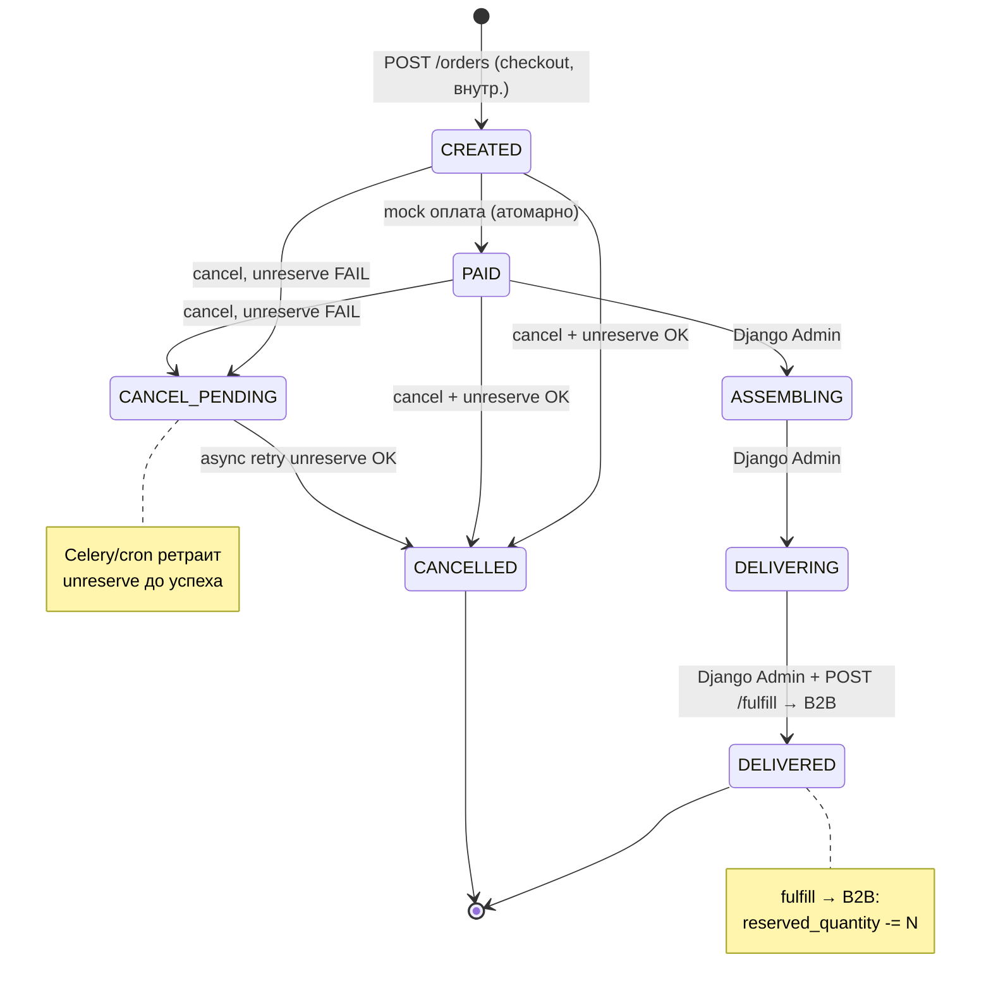
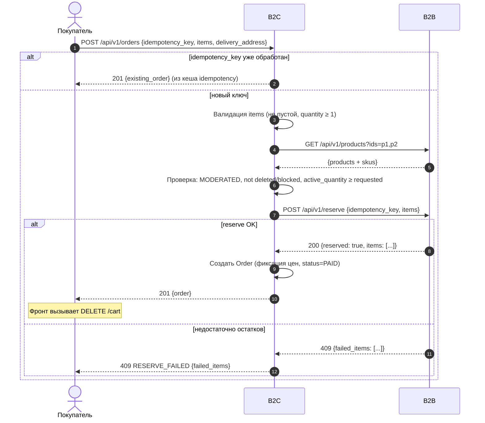
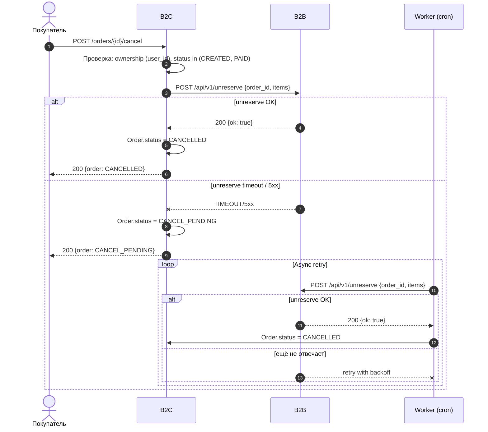
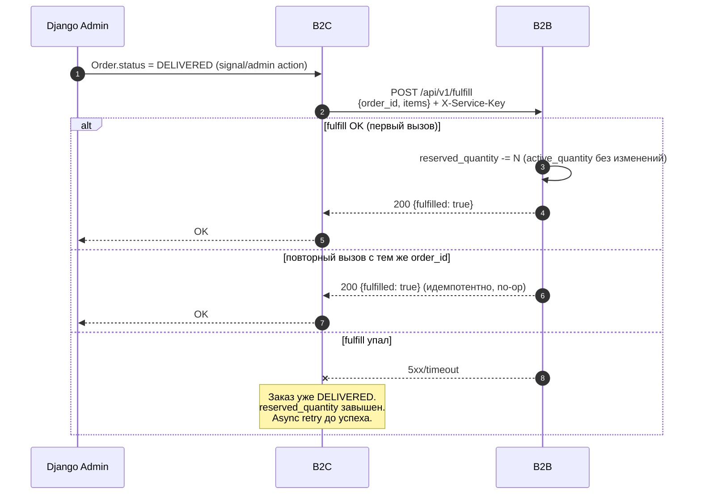

# B2C Orders -- Flows & Schemas

> Домен: оформление заказа, отслеживание, отмена, обработка событий от B2B.
> Сервис-владелец: B2C.
> Зависимости: B2B (reserve/unreserve/fulfill, GET products, входящие события).

---

## Order State Machine

```
CREATED ──→ PAID ──→ ASSEMBLING ──→ DELIVERING ──→ DELIVERED
   │           │                                       │
   ├──→ CANCELLED                                      └──→ POST /fulfill к B2B
   │        ▲                                                (списание резерва)
   │        │
   ├──→ CANCEL_PENDING ──→ CANCELLED (async retry unreserve)
   │
   PAID ──→ CANCELLED
        │
        └──→ CANCEL_PENDING
```



| Переход | Триггер | Кто инициирует |
|---------|---------|----------------|
| (new) -> CREATED | POST /api/v1/orders (checkout) | Покупатель |
| CREATED -> PAID | Mock-оплата (автоматически при создании) | Система |
| PAID -> ASSEMBLING | Смена статуса через Django Admin | Оператор склада |
| ASSEMBLING -> DELIVERING | Смена статуса через Django Admin | Оператор склада |
| DELIVERING -> DELIVERED | Смена статуса через Django Admin + POST /fulfill к B2B | Курьер / оператор |
| CREATED -> CANCELLED | POST /api/v1/orders/{id}/cancel + POST /unreserve к B2B | Покупатель |
| PAID -> CANCELLED | POST /api/v1/orders/{id}/cancel + POST /unreserve к B2B | Покупатель |
| CREATED -> CANCEL_PENDING | POST /api/v1/orders/{id}/cancel, но unreserve упал | Покупатель |
| PAID -> CANCEL_PENDING | POST /api/v1/orders/{id}/cancel, но unreserve упал | Покупатель |
| CANCEL_PENDING -> CANCELLED | Async retry unreserve (Celery / cron) | Система |

**Оплата = mock.** CREATED -> PAID происходит автоматически в рамках checkout. Отдельный endpoint оплаты не нужен. Заказ сразу создается в статусе PAID (CREATED -> PAID -- атомарная операция внутри checkout). Покупатель видит заказ уже как PAID.

> Упрощение: на практике CREATED как промежуточный статус существует в БД, но покупатель его не видит. Если команда хочет разделить создание и оплату (для будущей интеграции реальной платежки) -- пусть разделяет, но mock всегда возвращает success.

---

## Authorization (IDOR prevention)

> **Всегда проверяй ownership**. Для buyer-facing endpoints: извлечь `user_id` из JWT claims. Если объект не принадлежит пользователю -- возвращать **404** (не 403), чтобы не раскрывать существование чужих заказов.

Правила для всех buyer-facing endpoints (`GET /orders`, `GET /orders/{id}`, `POST /orders/{id}/cancel`):

1. `user_id` берётся **только из JWT claims**, никогда из query, body или заголовков `X-User-Id` (которые можно подделать без API Gateway).
2. Фильтр `WHERE user_id = jwt.user_id` применяется автоматически на уровне queryset.
3. При обращении к чужому заказу -- **404 ORDER_NOT_FOUND**, не 403. Это:
   - не раскрывает факт существования заказа
   - не позволяет enumerate UUID через разницу статусов 403/404
   - согласованный ответ с ситуацией "заказа вообще нет"
4. Для межсервисных endpoint (`POST /events/product` от B2B) -- `X-Service-Key`, ownership по user_id неприменим.

---

## Cart-to-Order Bridge

Корзина (B2C Cart) и заказы (B2C Orders) -- два домена внутри одного сервиса B2C.

**Что хранит корзина:** `sku_id` + `quantity` + `user_id`/`session_id`.

**POST /api/v1/orders НЕ принимает cart_id.** Фронт берёт items из GET /api/v1/cart и передаёт их напрямую в POST /api/v1/orders. Это даёт гибкость: можно оформить заказ не на всю корзину (частичный checkout). Но для MVP допустимо и "всю корзину" -- решение за командой.

**Checkout -- это POST /api/v1/orders, а НЕ отдельный endpoint.** Покупатель нажимает "Оформить заказ", фронт вызывает POST /api/v1/orders. Отдельного `/checkout` нет.

**После создания заказа:** фронт очищает корзину (DELETE /api/v1/cart -- клиентский вызов).

---

<a name="b2c-9-checkout"></a>

## Flow B2C-9: Checkout -- Создание заказа

### Последовательность

```
Покупатель                B2C                         B2B
    │                      │                           │
    │  POST /api/v1/orders │                           │
    │  {idempotency_key,   │                           │
    │   items, ...}        │                           │
    │ ────────────────────>│                           │
    │                      │                           │
    │                      │  0. Idempotency check     │
    │                      │     (key уже есть? →      │
    │                      │      вернуть заказ)       │
    │                      │                           │
    │                      │  1. Валидация items       │
    │                      │     (не пустой, qty > 0)  │
    │                      │                           │
    │                      │  2. GET /api/v1/products  │
    │                      │     ?ids=p1,p2            │
    │                      │ ─────────────────────────>│
    │                      │     {products + skus}     │
    │                      │ <─────────────────────────│
    │                      │                           │
    │                      │  3. Проверка:             │
    │                      │     - товар MODERATED?    │
    │                      │     - не deleted/blocked? │
    │                      │     - active_quantity     │
    │                      │       >= requested?       │
    │                      │                           │
    │                      │  4. POST /api/v1/reserve  │
    │                      │     {idempotency_key,     │
    │                      │      items: [{sku_id,     │
    │                      │       quantity}]}         │
    │                      │ ─────────────────────────>│
    │                      │     {reserved: true,      │
    │                      │      items: [...]}        │
    │                      │ <─────────────────────────│
    │                      │                           │
    │                      │  5. Создать Order в БД    │
    │                      │     - зафиксировать цены  │
    │                      │     - status = PAID       │
    │                      │                           │
    │  201 {order}         │                           │
    │ <────────────────────│                           │
    │                      │                           │
    │  6. Фронт очищает   │                           │
    │     корзину          │                           │
```



### Endpoint

**POST /api/v1/orders**

#### Headers

| Header | Required | Description |
|--------|----------|-------------|
| Authorization | yes | Bearer JWT-token |

#### Request Body

```json
{
  "idempotency_key": "f47ac10b-58cc-4372-a567-0e02b2c3d479",
  "items": [
    {
      "sku_id": "7c9e6679-7425-40de-944b-e07fc1f90ae7",
      "quantity": 2
    },
    {
      "sku_id": "8a4e3f9c-1a2b-4c8d-9e5f-6b7a8c9d0e1f",
      "quantity": 1
    }
  ],
  "delivery_address": "г. Екатеринбург, ул. Мира 19, кв. 42"
}
```

| Поле | Тип | Required | Описание |
|------|-----|----------|----------|
| idempotency_key | string (UUID) | yes | Защита от повторного checkout |
| items | array | yes | Список SKU для заказа |
| items[].sku_id | string (UUID) | yes | ID варианта товара |
| items[].quantity | integer | yes | Количество, >= 1 |
| delivery_address | string | no | Адрес доставки (mock, не влияет на логику) |

> **Почему нет cart_id?** Фронт берёт items из корзины и передаёт напрямую. Это позволяет частичный checkout.

> **Почему delivery_address опционален?** Доставка = mock. Для учебного проекта нет реальной логистики. Если команда хочет -- пусть добавляет, но оно не влияет на логику.

#### Response 201 Created

```json
{
  "id": "a1b2c3d4-e5f6-7890-abcd-ef1234567890",
  "status": "PAID",
  "items": [
    {
      "id": "d4e5f6a7-b8c9-0123-4567-890abcdef012",
      "sku_id": "7c9e6679-7425-40de-944b-e07fc1f90ae7",
      "product_id": "550e8400-e29b-41d4-a716-446655440000",
      "product_title": "iPhone 15 Pro Max",
      "sku_name": "256GB Black",
      "quantity": 2,
      "unit_price": 12999000,
      "line_total": 25998000
    },
    {
      "id": "e5f6a7b8-c9d0-1234-5678-90abcdef0123",
      "sku_id": "8a4e3f9c-1a2b-4c8d-9e5f-6b7a8c9d0e1f",
      "product_id": "550e8400-e29b-41d4-a716-446655440000",
      "product_title": "iPhone 15 Pro Max",
      "sku_name": "256GB White",
      "quantity": 1,
      "unit_price": 12999000,
      "line_total": 12999000
    }
  ],
  "total_amount": 38997000,
  "delivery_address": "г. Екатеринбург, ул. Мира 19, кв. 42",
  "created_at": "2026-04-16T10:30:00Z",
  "updated_at": "2026-04-16T10:30:00Z"
}
```

#### Response 400 Bad Request

```json
{
  "code": "INVALID_REQUEST",
  "message": "Список items не может быть пустым"
}
```

#### Response 401 Unauthorized

```json
{
  "code": "UNAUTHORIZED",
  "message": "Требуется авторизация"
}
```

#### Response 409 Conflict -- резервирование не удалось

Возвращается, когда B2B вернул ошибку резервирования (хотя бы один SKU не может быть зарезервирован). **All-or-nothing: ничего не резервируется, заказ не создается.**

```json
{
  "code": "RESERVE_FAILED",
  "message": "Не удалось зарезервировать товары",
  "failed_items": [
    {
      "sku_id": "8a4e3f9c-1a2b-4c8d-9e5f-6b7a8c9d0e1f",
      "requested": 1,
      "available": 0,
      "reason": "INSUFFICIENT_STOCK"
    }
  ]
}
```

| reason | Описание |
|--------|----------|
| OUT_OF_STOCK | active_quantity = 0 |
| INSUFFICIENT_STOCK | active_quantity > 0, но < requested |
| PRODUCT_BLOCKED | Товар заблокирован модерацией |
| PRODUCT_DELETED | Товар удален продавцом |
| SKU_NOT_FOUND | SKU не существует в B2B |

> **Формат failed_items совпадает с B2B reserve 409.** B2C проксирует failed_items из B2B без трансформации. Дополнительные reason (PRODUCT_BLOCKED, PRODUCT_DELETED, SKU_NOT_FOUND) определяются B2C на шаге 3 (до вызова reserve).

#### Response 422 Unprocessable Entity

```json
{
  "code": "INVALID_QUANTITY",
  "message": "Количество должно быть не менее 1 для каждой позиции"
}
```

#### Response 503 Service Unavailable

```json
{
  "code": "B2B_UNAVAILABLE",
  "message": "Сервис товаров временно недоступен, попробуйте позже"
}
```

### Логика checkout (pseudocode)

```python
def create_order(user_id, items, idempotency_key, delivery_address=None):
    # 0. Idempotency check
    existing = Order.objects.filter(idempotency_key=idempotency_key).first()
    if existing:
        return existing  # 200, а не 201

    # 1. Валидация
    if not items:
        raise ValidationError("items is empty")
    for item in items:
        if item.quantity < 1:
            raise ValidationError("quantity must be >= 1")

    # 2. Проверка наличия в B2B
    sku_ids = [item.sku_id for item in items]
    products = b2b_client.get_products_by_sku_ids(sku_ids)
    
    failed = []
    for item in items:
        sku = find_sku(products, item.sku_id)
        if not sku:
            failed.append({"sku_id": item.sku_id, "reason": "SKU_NOT_FOUND"})
        elif sku.product.status == "BLOCKED":
            failed.append({"sku_id": item.sku_id, "reason": "PRODUCT_BLOCKED"})
        elif sku.product.deleted:
            failed.append({"sku_id": item.sku_id, "reason": "PRODUCT_DELETED"})
        elif sku.active_quantity < item.quantity:
            failed.append({
                "sku_id": item.sku_id,
                "reason": "INSUFFICIENT_STOCK" if sku.active_quantity > 0 else "OUT_OF_STOCK",
                "requested": item.quantity,
                "available": sku.active_quantity,
            })
    
    if failed:
        raise ConflictError(failed_items=failed)

    # 3. Резервирование (all-or-nothing)
    reserve_result = b2b_client.reserve(
        idempotency_key=idempotency_key,
        items=[
            {"sku_id": item.sku_id, "quantity": item.quantity}
            for item in items
        ]
    )
    
    if not reserve_result.reserved:
        raise ConflictError(failed_items=reserve_result.failed_items)

    # 4. Создание заказа (в транзакции)
    with transaction.atomic():
        order = Order.objects.create(
            user_id=user_id,
            status="PAID",  # mock-оплата: сразу PAID
            total_amount=sum(
                find_sku(products, i.sku_id).price * i.quantity
                for i in items
            ),
            idempotency_key=idempotency_key,
            delivery_address=delivery_address,
        )
        
        for item in items:
            sku = find_sku(products, item.sku_id)
            OrderItem.objects.create(
                order=order,
                sku_id=item.sku_id,
                product_id=sku.product.id,
                product_title=sku.product.title,  # фиксируем!
                sku_name=sku.name,                  # фиксируем!
                quantity=item.quantity,
                unit_price=sku.price,               # фиксируем!
                line_total=sku.price * item.quantity,
            )

    return order  # 201
```

### Вызов B2B: POST /api/v1/reserve

```
POST /api/v1/reserve HTTP/1.1
Host: b2b-service:8000
Content-Type: application/json
X-Service-Key: {b2c_to_b2b_key}
```

```json
{
  "idempotency_key": "f47ac10b-58cc-4372-a567-0e02b2c3d479",
  "items": [
    {"sku_id": "7c9e6679-7425-40de-944b-e07fc1f90ae7", "quantity": 2},
    {"sku_id": "8a4e3f9c-1a2b-4c8d-9e5f-6b7a8c9d0e1f", "quantity": 1}
  ]
}
```

**Успех (200):**
```json
{
  "reserved": true,
  "items": [
    {
      "sku_id": "7c9e6679-7425-40de-944b-e07fc1f90ae7",
      "reserved_quantity": 2,
      "remaining_stock": 8
    },
    {
      "sku_id": "8a4e3f9c-1a2b-4c8d-9e5f-6b7a8c9d0e1f",
      "reserved_quantity": 1,
      "remaining_stock": 4
    }
  ]
}
```

**Ошибка (409, all-or-nothing, ничего не зарезервировано):**
```json
{
  "reserved": false,
  "failed_items": [
    {
      "sku_id": "8a4e3f9c-1a2b-4c8d-9e5f-6b7a8c9d0e1f",
      "requested": 1,
      "available": 0,
      "reason": "INSUFFICIENT_STOCK"
    }
  ]
}
```

---

<a name="b2c-10-view-orders"></a>

## Flow B2C-10: Просмотр и отслеживание заказов

### GET /api/v1/orders -- Список заказов пользователя

#### Headers

| Header | Required | Description |
|--------|----------|-------------|
| Authorization | yes | Bearer JWT-token |

#### Query Parameters

| Параметр | Тип | Default | Описание |
|----------|-----|---------|----------|
| limit | integer | 20 | 1..100 |
| offset | integer | 0 | >= 0 |
| status | string | (all) | Фильтр: PAID, ASSEMBLING, DELIVERING, DELIVERED, CANCELLED, CANCEL_PENDING |

#### Response 200

```json
{
  "items": [
    {
      "id": "a1b2c3d4-e5f6-7890-abcd-ef1234567890",
      "status": "PAID",
      "total_amount": 38997000,
      "items_count": 2,
      "created_at": "2026-04-16T10:30:00Z",
      "updated_at": "2026-04-16T10:30:00Z"
    },
    {
      "id": "b2c3d4e5-f6a7-8901-bcde-f12345678901",
      "status": "DELIVERED",
      "total_amount": 12999000,
      "items_count": 1,
      "created_at": "2026-04-10T08:15:00Z",
      "updated_at": "2026-04-14T16:45:00Z"
    }
  ],
  "total_count": 2,
  "limit": 20,
  "offset": 0
}
```

> В списке заказов items не разворачиваются -- только `items_count`. Полные items доступны в GET /api/v1/orders/{id}.

#### Response 401

```json
{
  "code": "UNAUTHORIZED",
  "message": "Требуется авторизация"
}
```

---

### GET /api/v1/orders/{id} -- Детали заказа

#### Headers

| Header | Required | Description |
|--------|----------|-------------|
| Authorization | yes | Bearer JWT-token |

#### Path Parameters

| Параметр | Тип | Описание |
|----------|-----|----------|
| id | UUID | ID заказа |

#### Authorization (IDOR prevention)

**Ownership check**: извлечь `user_id` из JWT claims. Если `order.user_id != jwt.user_id` → **404** `ORDER_NOT_FOUND` (по ревью Guardian -- не раскрывать существование чужих заказов, не возвращать 403).

`user_id` берётся **только из JWT claims**, никогда из query/body/заголовков клиента.

#### Response 200

```json
{
  "id": "a1b2c3d4-e5f6-7890-abcd-ef1234567890",
  "status": "PAID",
  "items": [
    {
      "id": "d4e5f6a7-b8c9-0123-4567-890abcdef012",
      "sku_id": "7c9e6679-7425-40de-944b-e07fc1f90ae7",
      "product_id": "550e8400-e29b-41d4-a716-446655440000",
      "product_title": "iPhone 15 Pro Max",
      "sku_name": "256GB Black",
      "quantity": 2,
      "unit_price": 12999000,
      "line_total": 25998000
    },
    {
      "id": "e5f6a7b8-c9d0-1234-5678-90abcdef0123",
      "sku_id": "8a4e3f9c-1a2b-4c8d-9e5f-6b7a8c9d0e1f",
      "product_id": "550e8400-e29b-41d4-a716-446655440000",
      "product_title": "iPhone 15 Pro Max",
      "sku_name": "256GB White",
      "quantity": 1,
      "unit_price": 12999000,
      "line_total": 12999000
    }
  ],
  "total_amount": 38997000,
  "delivery_address": "г. Екатеринбург, ул. Мира 19, кв. 42",
  "created_at": "2026-04-16T10:30:00Z",
  "updated_at": "2026-04-16T10:30:00Z"
}
```

> **Цены из OrderItem, НЕ из B2B.** Цены зафиксированы при создании заказа. Даже если продавец изменил цену SKU -- в заказе остается цена на момент покупки.

#### Response 404

```json
{
  "code": "ORDER_NOT_FOUND",
  "message": "Заказ не найден"
}
```

> Заказ другого пользователя тоже возвращает 404 (не 403), чтобы не раскрывать факт существования чужих заказов.

---

<a name="b2c-11-cancel-order"></a>

## Flow B2C-11: Отмена заказа

### Последовательность

```
Покупатель                B2C                         B2B
    │                      │                           │
    │  POST /orders/{id}/  │                           │
    │    cancel            │                           │
    │ ────────────────────>│                           │
    │                      │                           │
    │                      │  1. Проверка:             │
    │                      │     - заказ существует?   │
    │                      │     - принадлежит user?   │
    │                      │     - status in           │
    │                      │       (CREATED, PAID)?    │
    │                      │                           │
    │                      │  2. POST /api/v1/unreserve│
    │                      │     {order_id, items}     │
    │                      │ ─────────────────────────>│
    │                      │     {unreserved: true,    │
    │                      │      items: [...]}        │
    │                      │ <─────────────────────────│
    │                      │                           │
    │                      │  3. Order.status =        │
    │                      │     CANCELLED             │
    │                      │                           │
    │  200 {order}         │                           │
    │ <────────────────────│                           │
```

**Если unreserve упал (таймаут, 5xx):**

```
Покупатель                B2C                         B2B
    │                      │                           │
    │  POST /orders/{id}/  │                           │
    │    cancel            │                           │
    │ ────────────────────>│                           │
    │                      │  POST /api/v1/unreserve   │
    │                      │ ─────────────────────────>│
    │                      │     TIMEOUT / 5xx         │
    │                      │ <─────────────────────────│
    │                      │                           │
    │                      │  Order.status =           │
    │                      │    CANCEL_PENDING         │
    │                      │                           │
    │  200 {order}         │  Async retry (Celery/cron)│
    │  status:             │  ─────────────────────────│
    │  CANCEL_PENDING      │                           │
    │ <────────────────────│  (при успехе unreserve    │
    │                      │   → status = CANCELLED)   │
```



### Endpoint

**POST /api/v1/orders/{id}/cancel**

#### Headers

| Header | Required | Description |
|--------|----------|-------------|
| Authorization | yes | Bearer JWT-token |

#### Request Body

Пустое тело. Вся информация берется из заказа.

#### Authorization (IDOR prevention)

**Ownership check**: извлечь `user_id` из JWT claims. Если `order.user_id != jwt.user_id` → **404** `ORDER_NOT_FOUND` (не 403, по ревью Guardian -- не раскрывать существование чужих заказов).

`user_id` берётся **только из JWT claims**. Клиент не может подделать `user_id` через query/body/заголовки.

#### Response 200

```json
{
  "id": "a1b2c3d4-e5f6-7890-abcd-ef1234567890",
  "status": "CANCELLED",
  "items": [
    {
      "id": "d4e5f6a7-b8c9-0123-4567-890abcdef012",
      "sku_id": "7c9e6679-7425-40de-944b-e07fc1f90ae7",
      "product_id": "550e8400-e29b-41d4-a716-446655440000",
      "product_title": "iPhone 15 Pro Max",
      "sku_name": "256GB Black",
      "quantity": 2,
      "unit_price": 12999000,
      "line_total": 25998000
    }
  ],
  "total_amount": 25998000,
  "created_at": "2026-04-16T10:30:00Z",
  "updated_at": "2026-04-16T11:00:00Z"
}
```

> Если unreserve упал -- status будет `"CANCEL_PENDING"` вместо `"CANCELLED"`.

#### Response 404 Not Found

```json
{
  "code": "ORDER_NOT_FOUND",
  "message": "Заказ не найден"
}
```

#### Response 409 Conflict -- нельзя отменить

```json
{
  "code": "CANCEL_NOT_ALLOWED",
  "message": "Отмена невозможна: заказ в статусе ASSEMBLING",
  "current_status": "ASSEMBLING"
}
```

Допустимые статусы для отмены: **CREATED**, **PAID**. Заказ в статусе ASSEMBLING, DELIVERING, DELIVERED -- отменить нельзя.

### Вызов B2B: POST /api/v1/unreserve

```
POST /api/v1/unreserve HTTP/1.1
Host: b2b-service:8000
Content-Type: application/json
X-Service-Key: {b2c_to_b2b_key}
```

```json
{
  "order_id": "a1b2c3d4-e5f6-7890-abcd-ef1234567890",
  "items": [
    {"sku_id": "7c9e6679-7425-40de-944b-e07fc1f90ae7", "quantity": 2},
    {"sku_id": "8a4e3f9c-1a2b-4c8d-9e5f-6b7a8c9d0e1f", "quantity": 1}
  ]
}
```

**Ответ (200):**
```json
{
  "unreserved": true,
  "items": [
    {
      "sku_id": "7c9e6679-7425-40de-944b-e07fc1f90ae7",
      "unreserved_quantity": 2,
      "remaining_stock": 10
    },
    {
      "sku_id": "8a4e3f9c-1a2b-4c8d-9e5f-6b7a8c9d0e1f",
      "unreserved_quantity": 1,
      "remaining_stock": 5
    }
  ]
}
```

B2B выполняет для каждого item: `active_quantity += quantity`, `reserved_quantity -= quantity`.

### CANCEL_PENDING -- async retry

Если unreserve при отмене упал (таймаут, 5xx), заказ переходит в `CANCEL_PENDING`. Async-задача (Celery task / management command по cron) периодически пытается вызвать unreserve для всех заказов в статусе `CANCEL_PENDING`. При успехе -- переводит в `CANCELLED`.

```python
# Celery task / management command
def retry_pending_cancellations():
    orders = Order.objects.filter(status="CANCEL_PENDING")
    for order in orders:
        try:
            b2b_client.unreserve(
                order_id=str(order.id),
                items=[
                    {"sku_id": str(item.sku_id), "quantity": item.quantity}
                    for item in order.items.all()
                ]
            )
            order.status = "CANCELLED"
            order.save()
        except B2BUnavailableError:
            pass  # retry на следующем запуске
```

---

<a name="b2c-12-handle-events"></a>

## Flow B2C-12: Обработка событий от B2B (PRODUCT_BLOCKED / PRODUCT_DELETED / SKU_OUT_OF_STOCK)

### Endpoint (входящий)

```
POST /api/v1/events/product
Content-Type: application/json
X-Service-Key: {b2b_to_b2c_key}
```

### Request -- PRODUCT_BLOCKED

```json
{
  "idempotency_key": "d7e8f9a0-b1c2-3456-abcd-789012345678",
  "event": "PRODUCT_BLOCKED",
  "product_id": "550e8400-e29b-41d4-a716-446655440000",
  "sku_ids": [
    "7c9e6679-7425-40de-944b-e07fc1f90ae7",
    "8a4e3f9c-1a2b-4c8d-9e5f-6b7a8c9d0e1f"
  ],
  "reason": "Описание не соответствует товару",
  "date": "2026-04-16T12:00:00Z"
}
```

### Request -- PRODUCT_DELETED

```json
{
  "idempotency_key": "e8f9a0b1-c2d3-4567-abcd-890123456789",
  "event": "PRODUCT_DELETED",
  "product_id": "550e8400-e29b-41d4-a716-446655440000",
  "sku_ids": [
    "7c9e6679-7425-40de-944b-e07fc1f90ae7"
  ],
  "reason": null,
  "date": "2026-04-16T12:00:00Z"
}
```

### Request -- SKU_OUT_OF_STOCK

```json
{
  "idempotency_key": "f9a0b1c2-d3e4-5678-abcd-901234567890",
  "event": "SKU_OUT_OF_STOCK",
  "product_id": "550e8400-e29b-41d4-a716-446655440000",
  "sku_ids": [
    "7c9e6679-7425-40de-944b-e07fc1f90ae7"
  ],
  "reason": null,
  "date": "2026-04-16T12:00:00Z"
}
```

### Request Schema

| Поле | Тип | Обязательное | Описание |
|------|-----|:---:|----------|
| idempotency_key | string (UUID) | да | Ключ идемпотентности |
| event | string (enum) | да | `PRODUCT_BLOCKED`, `PRODUCT_DELETED`, `SKU_OUT_OF_STOCK` |
| product_id | string (UUID) | да | ID товара |
| sku_ids | string[] (UUID[]) | да | Затронутые SKU |
| reason | string or null | нет | Причина (для PRODUCT_BLOCKED) |
| date | string (ISO 8601) | да | Время события |

### Response 200

```json
{
  "accepted": true
}
```

### Логика обработки

**Что делает B2C:**

1. **Корзина**: для каждого sku_id из события -- пометить cart_items как unavailable (поле `available = false` или удалить). При следующем GET /api/v1/cart покупатель увидит, что товар недоступен.

2. **Заказы**: **НЕ трогать**. Заказы с зафиксированными ценами продолжают обрабатываться. Продавец обязан отгрузить по уже принятому заказу.

3. **Избранное (wishlist)**: пометить как unavailable. При следующем запросе избранного товар будет показан как недоступный.

**Идемпотентность**: если событие с таким `idempotency_key` уже обработано -- вернуть 200 без повторной обработки.

---

<a name="b2c-13-fulfill"></a>

## Flow B2C-13: Fulfill -- списание резерва при DELIVERED

### Что происходит

Когда оператор через Django Admin переводит заказ в статус `DELIVERED`, B2C вызывает POST /api/v1/fulfill к B2B. Это финальное списание: `reserved_quantity -= quantity`. Без этого `reserved_quantity` копится бесконечно.

### Последовательность

```
Django Admin              B2C                         B2B
    │                      │                           │
    │  Order.status =      │                           │
    │    DELIVERED         │                           │
    │ ────────────────────>│                           │
    │                      │                           │
    │                      │  POST /api/v1/fulfill     │
    │                      │  {order_id, items}        │
    │                      │ ─────────────────────────>│
    │                      │                           │
    │                      │  reserved_quantity -= N   │
    │                      │  (товар уже отгружен,     │
    │                      │   active_quantity не      │
    │                      │   меняется)               │
    │                      │                           │
    │                      │  {fulfilled: true}        │
    │                      │ <─────────────────────────│
    │                      │                           │
    │  OK                  │                           │
    │ <────────────────────│                           │
```



### Вызов B2B: POST /api/v1/fulfill

```
POST /api/v1/fulfill HTTP/1.1
Host: b2b-service:8000
Content-Type: application/json
X-Service-Key: {b2c_to_b2b_key}
```

```json
{
  "order_id": "a1b2c3d4-e5f6-7890-abcd-ef1234567890",
  "items": [
    {"sku_id": "7c9e6679-7425-40de-944b-e07fc1f90ae7", "quantity": 2},
    {"sku_id": "8a4e3f9c-1a2b-4c8d-9e5f-6b7a8c9d0e1f", "quantity": 1}
  ]
}
```

**Ответ (200):**
```json
{
  "fulfilled": true
}
```

### Реализация

Можно реализовать как:
- Django Admin action, который после смены статуса вызывает B2B API
- Или сигнал (`post_save`) на модели Order, который при `status == DELIVERED` вызывает fulfill

```python
# Django signal или Admin action
def on_order_delivered(order):
    b2b_client.fulfill(
        order_id=str(order.id),
        items=[
            {"sku_id": str(item.sku_id), "quantity": item.quantity}
            for item in order.items.all()
        ]
    )
```

**Идемпотентность**: B2B использует `order_id` как ключ -- повторный вызов с тем же order_id возвращает 200 без изменений.

**Если fulfill упал**: заказ уже DELIVERED, покупатель получил товар. Fulfill нужно ретраить (async task). reserved_quantity будет завышен до успешного вызова, но это не влияет на покупателя -- только на отображение остатков у продавца.

---

## Schemas

### Order

| Поле | Тип | Описание |
|------|-----|----------|
| id | UUID | Уникальный ID заказа |
| user_id | UUID | ID покупателя (из JWT, не в ответе API) |
| status | string, enum | CREATED, PAID, ASSEMBLING, DELIVERING, DELIVERED, CANCELLED, CANCEL_PENDING |
| items | OrderItem[] | Позиции заказа |
| total_amount | integer | Общая сумма в копейках |
| delivery_address | string, nullable | Адрес доставки (опционально) |
| idempotency_key | UUID | Ключ идемпотентности (не в ответе API, только в БД) |
| created_at | string, ISO 8601 | Дата создания |
| updated_at | string, ISO 8601 | Дата последнего обновления |

### OrderItem

| Поле | Тип | Описание |
|------|-----|----------|
| id | UUID | Уникальный ID позиции |
| order_id | UUID | Ссылка на Order (FK, не в ответе API) |
| sku_id | UUID | Ссылка на SKU в B2B (зафиксирована) |
| product_id | UUID | Ссылка на Product в B2B (зафиксирована) |
| product_title | string | Название товара на момент покупки |
| sku_name | string | Название варианта на момент покупки |
| quantity | integer | Количество, >= 1 |
| unit_price | integer | Цена за единицу в копейках на момент покупки |
| line_total | integer | unit_price * quantity, в копейках |

### Почему фиксируем product_title, sku_name, unit_price

Продавец может изменить название или цену товара после покупки. Покупатель должен видеть то, что он покупал. OrderItem -- это исторический снимок, не ссылка на текущие данные B2B.

---

## Смена статусов через Django Admin

Переходы PAID -> ASSEMBLING -> DELIVERING -> DELIVERED выполняются оператором через Django Admin (прямой доступ к БД B2C).

**При DELIVERING -> DELIVERED** -- дополнительно вызывается POST /api/v1/fulfill к B2B (см. [B2C-13](#flow-b2c-13-fulfill--списание-резерва-при-delivered)).

**Почему не API-эндпоинт?** В учебном проекте нет WMS, нет курьерской системы, нет webhook от доставки. Преподаватель / оператор меняет статус вручную, моделируя работу склада и курьера.

**Что должна реализовать команда в Django Admin:**
- Список заказов с фильтрацией по статусу
- Кнопки / actions для смены статуса (только допустимые переходы)
- Валидация: нельзя перескочить (PAID -> DELIVERING) или вернуть (DELIVERING -> ASSEMBLING)
- При переходе в DELIVERED -- вызов fulfill к B2B

---

## Edge Cases

### 1. Race condition: два покупателя, последний товар

**Сценарий:** SKU #101: active_quantity = 1. Покупатель A и покупатель B одновременно оформляют заказ.

**Поведение:** B2B использует `SELECT FOR UPDATE` при резервировании.
- Первый запрос reserve проходит: active_quantity = 0, reserved_quantity = 1.
- Второй запрос reserve отклонен: active_quantity = 0 < 1.

**Гарантия:** Атомарность обеспечивается на стороне B2B. B2C не нужно дополнительных мер -- достаточно корректно обработать ответ reserve.

### 2. Товар заблокирован между корзиной и checkout

**Сценарий:** Покупатель добавил SKU в корзину. Модератор заблокировал товар. Покупатель нажимает "Оформить заказ".

**Поведение:** На шаге 3 checkout (проверка наличия) B2C обнаруживает `status: BLOCKED` -> возвращает 409 с `reason: PRODUCT_BLOCKED`.

**Рекомендация:** Фронт может вызвать GET /api/v1/cart перед checkout -- недоступные товары будут отмечены `available: false`.

### 3. Количество изменилось (было 5 в корзине, стало 2 на складе)

**Сценарий:** В корзине 3 штуки, на складе осталось 2.

**Поведение:** B2B при POST /api/v1/reserve возвращает ошибку `INSUFFICIENT_STOCK` для этого SKU. B2C возвращает 409 покупателю с деталями: `requested: 3, available: 2`.

**Действие покупателя:** Изменить количество в корзине и повторить checkout.

### 4. Двойной клик checkout (idempotency_key)

**Сценарий:** Покупатель нажал "Оформить" дважды. Два POST /api/v1/orders с одинаковым idempotency_key.

**Защита:** `idempotency_key` (UUID, генерируется фронтом при открытии страницы оформления). Если заказ с таким ключом уже существует -- возвращается существующий заказ (200, не 201).

**Реализация в БД:**

```sql
CREATE UNIQUE INDEX idx_orders_idempotency ON orders (idempotency_key);
```

Если фронт не передает `idempotency_key` -- B2C возвращает 400.

### 5. Unreserve failed при отмене (CANCEL_PENDING + retry)

**Сценарий:** Покупатель отменяет заказ. B2C вызывает POST /api/v1/unreserve, но B2B не отвечает (таймаут, 5xx).

**Поведение:** Заказ переходит в статус `CANCEL_PENDING`. Покупатель видит "Заказ в процессе отмены". Async-задача (Celery / cron) периодически ретраит unreserve. При успехе -- статус меняется на `CANCELLED`.

**Почему не 503?** Покупатель уже принял решение отменить. Откладывать отмену до "попробуйте позже" -- плохой UX. Лучше принять намерение и выполнить компенсирующую операцию асинхронно.

### 6. PRODUCT_BLOCKED после checkout (заказ продолжается)

**Сценарий:** Покупатель оформил заказ на товар. После этого модератор заблокировал товар. B2C получает событие PRODUCT_BLOCKED.

**Поведение:** Заказ НЕ отменяется. Цены и данные зафиксированы в OrderItem. Продавец обязан отгрузить по уже принятому заказу. Событие влияет только на корзину и избранное.

### 7. B2B недоступен при checkout (503)

**Сценарий:** Покупатель оформляет заказ, но B2B не отвечает (на шаге 2 GET products или шаге 4 POST reserve).

**Поведение:** B2C возвращает 503 `B2B_UNAVAILABLE`. Заказ не создается. Покупатель может повторить позже.

### 8. Корзина пуста при checkout

**Сценарий:** Покупатель вызывает POST /api/v1/orders с пустым `items: []`.

**Поведение:** 400 Bad Request, `"Список items не может быть пустым"`.

### 9. SKU из разных продуктов в одном заказе

**Сценарий:** В корзине телефон и чехол (разные product_id). Резервирование одного SKU прошло, второго -- нет.

**Поведение:** All-or-nothing. Если хотя бы один SKU не зарезервирован -- ни один не резервируется. B2B гарантирует атомарность batch-reserve.

---

## Сводная таблица эндпоинтов

| Метод | Путь | Описание | Auth |
|-------|------|----------|------|
| POST | /api/v1/orders | Создание заказа (checkout) | Bearer JWT |
| GET | /api/v1/orders | Список заказов пользователя | Bearer JWT |
| GET | /api/v1/orders/{id} | Детали заказа | Bearer JWT |
| POST | /api/v1/orders/{id}/cancel | Отмена заказа | Bearer JWT |
| POST | /api/v1/events/product | Входящие события от B2B | X-Service-Key |

## Зависимости от B2B

| Вызов B2C -> B2B | Когда | Формат |
|-------------------|-------|--------|
| GET /api/v1/products?ids=... | Checkout, шаг 2 (проверка) | Batch-запрос по ID продуктов |
| POST /api/v1/reserve | Checkout, шаг 4 | `{idempotency_key, items: [{sku_id, quantity}]}` |
| POST /api/v1/unreserve | Отмена заказа | `{order_id, items: [{sku_id, quantity}]}` |
| POST /api/v1/fulfill | DELIVERED (Django Admin) | `{order_id, items: [{sku_id, quantity}]}` |

## Входящие события от B2B

| Событие | Endpoint | Действие |
|---------|----------|----------|
| PRODUCT_BLOCKED | POST /api/v1/events/product | Корзина: unavailable. Заказы: не трогать. Wishlist: unavailable |
| PRODUCT_DELETED | POST /api/v1/events/product | Корзина: unavailable. Заказы: не трогать. Wishlist: unavailable |
| SKU_OUT_OF_STOCK | POST /api/v1/events/product | Корзина: unavailable. Заказы: не трогать. Wishlist: unavailable |

Все вызовы к B2B включают заголовок `X-Service-Key` (межсервисная аутентификация).
