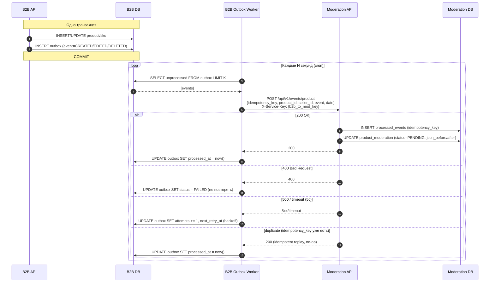
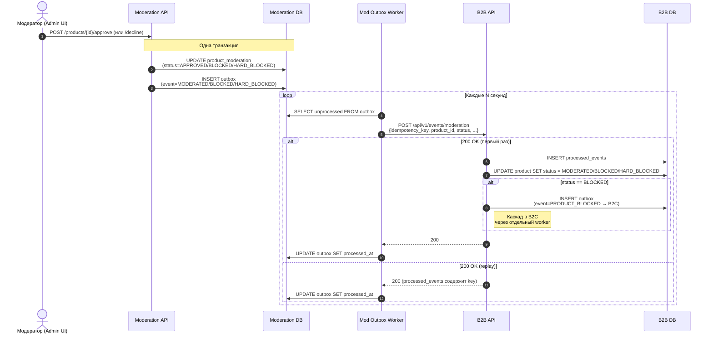
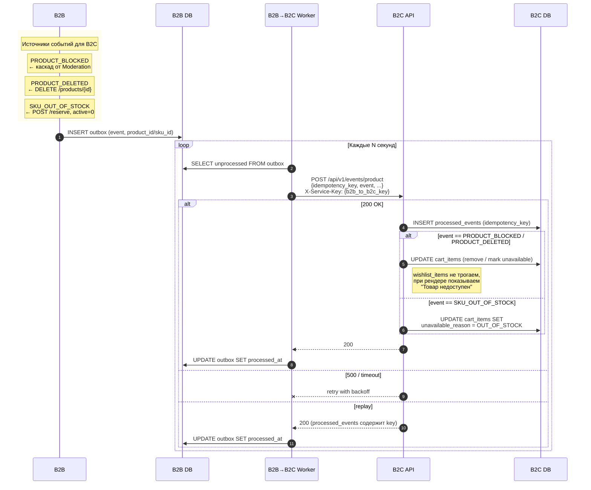

# Events Schema — Межсервисные события NeoMarket

Формальные схемы всех асинхронных событий между сервисами. Реализация — HTTP callback (приветствуется Kafka/RabbitMQ).

> **Соглашения**: все ID — UUID. Все поля — snake_case. Цены — integer в копейках. Даты — ISO 8601. Межсервисная аутентификация — заголовок `X-Service-Key`. Каждое событие содержит `idempotency_key`.

---

## Общие поля всех событий

Каждое событие содержит `idempotency_key` — UUID, генерируемый отправителем. Получатель использует его для дедупликации.

```yaml
idempotency_key:
  type: string
  format: uuid
  description: "Уникальный ключ события, генерируется отправителем. Для дедупликации повторных доставок."
```

---

## 1. B2B -> Moderation

### Sequence (outbox + retry)



### Endpoint

```
POST {moderation_url}/api/v1/events/product
Content-Type: application/json
X-Service-Key: {b2b_to_mod_key}
```

### Общая schema

```json
{
  "idempotency_key": "d1e2f3a4-b5c6-7890-abcd-ef1234567890",
  "product_id": "a1b2c3d4-e5f6-7890-abcd-ef1234567890",
  "seller_id": "c3d4e5f6-a7b8-9012-cdef-123456789012",
  "event": "CREATED",
  "date": "2026-03-15T14:30:00.000Z"
}
```

| Поле | Тип | Обязательное | Описание |
|------|-----|:---:|----------|
| idempotency_key | string (uuid) | да | Ключ идемпотентности |
| product_id | string (uuid) | да | ID товара в B2B |
| seller_id | string (uuid) | да | ID продавца |
| event | string (enum) | да | `CREATED`, `EDITED`, `DELETED` |
| date | string (ISO 8601) | да | Время события на стороне B2B |

### Response от Moderation

| Код | Значение | Действие B2B |
|-----|----------|--------------|
| 200 | Событие принято | Удалить из outbox |
| 400 | Невалидные данные | Не повторять, пометить как FAILED |
| 500 | Ошибка сервера | Повторить (retry) |
| Timeout (5 сек) | Нет ответа | Повторить (retry) |

---

### Событие CREATED

**Когда**: создан первый SKU для нового товара. Товар ранее не был на модерации.

**Триггер**: `POST /api/v1/skus` при условии, что товар в статусе `CREATED` и у него нет других SKU.

**Что делает Moderation**:
1. Создает запись в `product_moderation`: `json_before = null`, `status = PENDING`
2. Запрашивает текущее состояние товара: `GET {b2b_url}/api/v1/products/{product_id}` -> `json_after`
3. Товар попадает в очередь 1 (новые товары)

```json
{
  "idempotency_key": "d1e2f3a4-b5c6-7890-abcd-ef1234567890",
  "product_id": "a1b2c3d4-e5f6-7890-abcd-ef1234567890",
  "seller_id": "c3d4e5f6-a7b8-9012-cdef-123456789012",
  "event": "CREATED",
  "date": "2026-03-15T14:30:00.000Z"
}
```

---

### Событие EDITED

**Когда**: изменен товар (`PUT /products/{id}`) или его SKU (`PUT /skus/{id}`). Товар был в статусе `MODERATED` или `BLOCKED`.

**Триггер**: `PUT /api/v1/products/{id}` или `PUT /api/v1/skus/{id}` при условии, что текущий статус `MODERATED` или `BLOCKED`.

**Что делает Moderation**:
1. `json_before = старый json_after` (предыдущее состояние)
2. Запрашивает новое состояние: `GET {b2b_url}/api/v1/products/{product_id}` -> новый `json_after`
3. Товар попадает в соответствующую очередь:
   - Очередь 2: если предыдущий статус был BLOCKED (исправленные после блокировки)
   - Очередь 3: если `active_quantity > 0` (продается, изменения критичны)
   - Очередь 4: если `active_quantity = 0` (не продается, менее срочно)

---

### Событие DELETED

**Когда**: товар мягко удален (deleted = true).

**Триггер**: `DELETE /api/v1/products/{id}`.

**Что делает Moderation**:
1. Если товар есть в `product_moderation` с `status = PENDING` — удалить из очереди
2. Пометить как deleted (не показывать модератору)

---

## 2. Moderation -> B2B

### Sequence (каскад в B2C при BLOCKED)



### Endpoint

```
POST {b2b_url}/api/v1/events/moderation
Content-Type: application/json
X-Service-Key: {mod_to_b2b_key}
```

### Response от B2B

| Код | Значение | Действие Moderation |
|-----|----------|---------------------|
| 200 | Событие принято | Удалить из outbox |
| 400 | product_id не найден / невалидные данные | Не повторять |
| 500 | Ошибка сервера | Повторить (retry) |

---

### Событие MODERATED (одобрение)

**Когда**: модератор одобрил товар.

**Триггер**: `POST /api/v1/products/{product_id}/approve` в Moderation.

```json
{
  "idempotency_key": "a4b5c6d7-e8f9-0123-defg-456789012345",
  "product_id": "a1b2c3d4-e5f6-7890-abcd-ef1234567890",
  "status": "MODERATED"
}
```

**Что делает B2B**:
1. Обновляет статус товара на `MODERATED`
2. `blocked = false`
3. Товар становится доступен в каталоге

---

### Событие BLOCKED (блокировка)

**Когда**: модератор заблокировал товар (мягко или жестко).

**Триггер**: `POST /api/v1/products/{product_id}/decline` в Moderation.

**Мягкая блокировка** (продавец может исправить):

```json
{
  "idempotency_key": "b5c6d7e8-f9a0-1234-efgh-567890123456",
  "product_id": "a1b2c3d4-e5f6-7890-abcd-ef1234567890",
  "status": "BLOCKED",
  "hard_block": false,
  "blocking_reason": {
    "id": "a7b8c9d0-1234-5678-ef01-890123456789",
    "title": "Описание не соответствует товару",
    "comment": "Несоответствие описания и фотографий"
  },
  "field_reports": [
    {
      "field_name": "description",
      "sku_id": null,
      "comment": "В описании указан материал 'натуральная кожа', на фото — синтетика"
    }
  ]
}
```

**Жёсткая блокировка** (необратимо, контрафакт/запрещенный товар):

```json
{
  "idempotency_key": "c6d7e8f9-a0b1-2345-fghi-678901234567",
  "product_id": "a1b2c3d4-e5f6-7890-abcd-ef1234567890",
  "status": "BLOCKED",
  "hard_block": true,
  "blocking_reason": {
    "id": "b8c9d0e1-2345-6789-f012-901234567890",
    "title": "Контрафактный товар",
    "comment": "Поддельная продукция"
  },
  "field_reports": []
}
```

### BLOCKED Schema

| Поле | Тип | Обязательное | Описание |
|------|-----|:---:|----------|
| idempotency_key | string (uuid) | да | Ключ идемпотентности |
| product_id | string (uuid) | да | ID товара |
| status | string | да | `"BLOCKED"` |
| hard_block | boolean | да | `true` = необратимая блокировка |
| blocking_reason | object | да | Причина блокировки |
| blocking_reason.id | string (uuid) | да | ID причины из справочника |
| blocking_reason.title | string | да | Текст причины |
| blocking_reason.comment | string | да | Комментарий модератора |
| field_reports | FieldReport[] | да | Замечания по полям (может быть пустой массив) |

### FieldReport Schema

| Поле | Тип | Обязательное | Описание |
|------|-----|:---:|----------|
| field_name | string (enum) | да | `title`, `description`, `product_images`, `category`, `sku_name`, `sku_image`, `sku_price` |
| sku_id | string (uuid) / null | нет | ID SKU (null если замечание к товару) |
| comment | string | да | Комментарий модератора |

**Что делает B2B при мягкой блокировке (hard_block = false)**:
1. Обновляет статус товара на `BLOCKED`
2. `blocked = true`
3. Сохраняет `blocking_reason` и `field_reports` для отображения продавцу
4. Продавец может исправить и отправить на повторную модерацию
5. Отправляет каскадное событие `PRODUCT_BLOCKED` в B2C

**Что делает B2B при жёсткой блокировке (hard_block = true)**:
1. Обновляет статус товара на `HARD_BLOCKED`
2. `blocked = true`
3. Товар необратимо заблокирован — продавец не может редактировать
4. Отправляет каскадное событие `PRODUCT_BLOCKED` в B2C

---

## 3. B2B -> B2C

### Sequence (каскад и прямые события)



### Endpoint

```
POST {b2c_url}/api/v1/events/product
Content-Type: application/json
X-Service-Key: {b2b_to_b2c_key}
```

### Response от B2C

| Код | Значение | Действие B2B |
|-----|----------|--------------|
| 200 | Событие принято | Удалить из outbox |
| 400 | Невалидные данные | Не повторять |
| 500 | Ошибка сервера | Повторить (retry) |

---

### Событие PRODUCT_BLOCKED

**Когда**: товар заблокирован модератором. Каскад: Moderation -> B2B -> B2C.

```json
{
  "idempotency_key": "d7e8f9a0-b1c2-3456-ghij-789012345678",
  "event": "PRODUCT_BLOCKED",
  "product_id": "a1b2c3d4-e5f6-7890-abcd-ef1234567890",
  "sku_ids": [
    "b2c3d4e5-f6a7-8901-bcde-f12345678901",
    "c3d4e5f6-a7b8-9012-cdef-234567890123"
  ],
  "date": "2026-03-15T14:30:00.000Z"
}
```

**Что делает B2C**:
1. Удаляет (или помечает недоступными) `cart_items` с этими `sku_ids`
2. В `wishlist_items` — не удаляет, при отображении показывает "Товар недоступен"

---

### Событие PRODUCT_DELETED

**Когда**: продавец удалил товар (мягкое удаление, `deleted = true`).

```json
{
  "idempotency_key": "e8f9a0b1-c2d3-4567-hijk-890123456789",
  "event": "PRODUCT_DELETED",
  "product_id": "a1b2c3d4-e5f6-7890-abcd-ef1234567890",
  "sku_ids": [
    "b2c3d4e5-f6a7-8901-bcde-f12345678901"
  ],
  "date": "2026-03-16T09:00:00.000Z"
}
```

**Что делает B2C**: аналогично PRODUCT_BLOCKED.

---

### Событие SKU_OUT_OF_STOCK

**Когда**: `active_quantity` SKU стал 0 (раскупили или зарезервировали последний).

**Триггер**: после `POST /reserve` или `POST /invoices/{id}/accept`, если `active_quantity` конкретного SKU стал 0.

```json
{
  "idempotency_key": "f9a0b1c2-d3e4-5678-ijkl-901234567890",
  "event": "SKU_OUT_OF_STOCK",
  "sku_id": "b2c3d4e5-f6a7-8901-bcde-f12345678901",
  "product_id": "a1b2c3d4-e5f6-7890-abcd-ef1234567890",
  "date": "2026-03-15T16:00:00.000Z"
}
```

**Что делает B2C**:
1. Находит `cart_items` с этим `sku_id`
2. Помечает как "Нет в наличии" (не удаляет — товар может появиться снова после приёмки накладной)

---

## Сводная таблица событий

| # | Направление | Событие | Endpoint | Триггер |
|---|-------------|---------|----------|---------|
| 1 | B2B -> Mod | CREATED | `POST {mod}/api/v1/events/product` | Первый SKU для нового товара |
| 2 | B2B -> Mod | EDITED | `POST {mod}/api/v1/events/product` | PUT товара/SKU при MODERATED/BLOCKED |
| 3 | B2B -> Mod | DELETED | `POST {mod}/api/v1/events/product` | DELETE товара (soft delete) |
| 4 | Mod -> B2B | MODERATED | `POST {b2b}/api/v1/events/moderation` | Модератор approve |
| 5 | Mod -> B2B | BLOCKED | `POST {b2b}/api/v1/events/moderation` | Модератор decline |
| 6 | B2B -> B2C | PRODUCT_BLOCKED | `POST {b2c}/api/v1/events/product` | Каскад: Mod -> B2B -> B2C |
| 7 | B2B -> B2C | PRODUCT_DELETED | `POST {b2c}/api/v1/events/product` | Продавец удалил товар |
| 8 | B2B -> B2C | SKU_OUT_OF_STOCK | `POST {b2c}/api/v1/events/product` | active_quantity == 0 |

---

## Retry и идемпотентность

### Outbox pattern

Событие записывается в таблицу `outbox` в той же транзакции, что и изменение данных. Отдельный worker отправляет события из outbox.

```sql
CREATE TABLE outbox (
    id UUID PRIMARY KEY DEFAULT gen_random_uuid(),
    idempotency_key UUID NOT NULL UNIQUE,
    event_type VARCHAR(50) NOT NULL,
    payload JSONB NOT NULL,
    target_url VARCHAR(500) NOT NULL,
    status VARCHAR(20) NOT NULL DEFAULT 'PENDING',  -- PENDING, SENT, FAILED
    retry_count INTEGER NOT NULL DEFAULT 0,
    next_retry_at TIMESTAMP,
    created_at TIMESTAMP NOT NULL DEFAULT now(),
    sent_at TIMESTAMP
);
```

### Retry policy

1. Сохранить событие в outbox
2. Первая попытка — сразу
3. При ошибке (5xx, timeout): экспоненциальный backoff:
   - 30с -> 60с -> 120с -> 240с -> 480с -> 960с
4. Максимум **10 попыток**, после чего пометить как `FAILED`
5. FAILED события — алерт в мониторинг, ручное разрешение

### Идемпотентность на стороне получателя

Получатель хранит обработанные `idempotency_key` и игнорирует повторные.

## Idempotency keys: lifetime and scope

**Scope**: `(sender_service, idempotency_key)` — пара уникальна. Один и тот же UUID от разных отправителей — разные события.

**TTL**: 24 часа в таблице `processed_events`. Повторная доставка в пределах TTL — вернуть cached response, не обрабатывать повторно. Доставка старше TTL — обработать как новое событие.

**Cleanup**: management command `cleanup_processed_events`, запускается раз в час. Удаляет записи старше 24 часов:

```sql
DELETE FROM processed_events WHERE processed_at < NOW() - INTERVAL '24 hours';
```

### Таблица processed_events

```sql
CREATE TABLE processed_events (
    id UUID PRIMARY KEY DEFAULT gen_random_uuid(),
    sender_service VARCHAR(20) NOT NULL,  -- 'b2b' | 'moderation' | 'b2c'
    idempotency_key UUID NOT NULL,
    response_cached JSONB,
    processed_at TIMESTAMP NOT NULL DEFAULT now()
);

CREATE UNIQUE INDEX idx_processed_events_sender_key
    ON processed_events (sender_service, idempotency_key);

CREATE INDEX idx_processed_events_processed_at
    ON processed_events (processed_at);
```

### Алгоритм обработки входящего события

1. Вычислить `(sender_service, idempotency_key)` по заголовку `X-Service-Key` и полю `idempotency_key` из тела.
2. `SELECT response_cached FROM processed_events WHERE sender_service = ? AND idempotency_key = ?`.
3. Если найдено — вернуть `response_cached` как ответ.
4. Если не найдено — обработать событие в транзакции:
   - бизнес-логика (INSERT / UPDATE доменных таблиц)
   - `INSERT INTO processed_events (...)`
   - commit
5. При UNIQUE violation на шаге 4 (конкурентная доставка) — откатить транзакцию, вернуть ответ из шага 2.

### Reserve operations (отдельный TTL)

Для резервов `B2B-8` — TTL **1 час**, не 24. Обоснование: резерв краткосрочный (checkout -> оплата за ~30 минут), держать ключи дольше не имеет смысла.

---

## Межсервисная аутентификация

Каждый вызов между сервисами содержит заголовок:

```
X-Service-Key: <shared-secret>
```

| Направление | Переменная окружения | Описание |
|-------------|---------------------|----------|
| B2B -> Moderation | `B2B_TO_MOD_KEY` | Отправка событий CREATED/EDITED/DELETED |
| Moderation -> B2B (события) | `MOD_TO_B2B_KEY` | Результат модерации MODERATED/BLOCKED |
| Moderation -> B2B (данные) | `MOD_TO_B2B_KEY` | GET /products/{id} для json_after |
| B2C -> B2B | `B2C_TO_B2B_KEY` | Каталог, карточка, reserve/unreserve |
| B2B -> B2C | `B2B_TO_B2C_KEY` | События PRODUCT_BLOCKED/DELETED/OUT_OF_STOCK |

Ключи генерируются при деплое (достаточно UUID). Хранятся в переменных окружения. Сервис-получатель отклоняет запросы без валидного ключа (401 Unauthorized).
