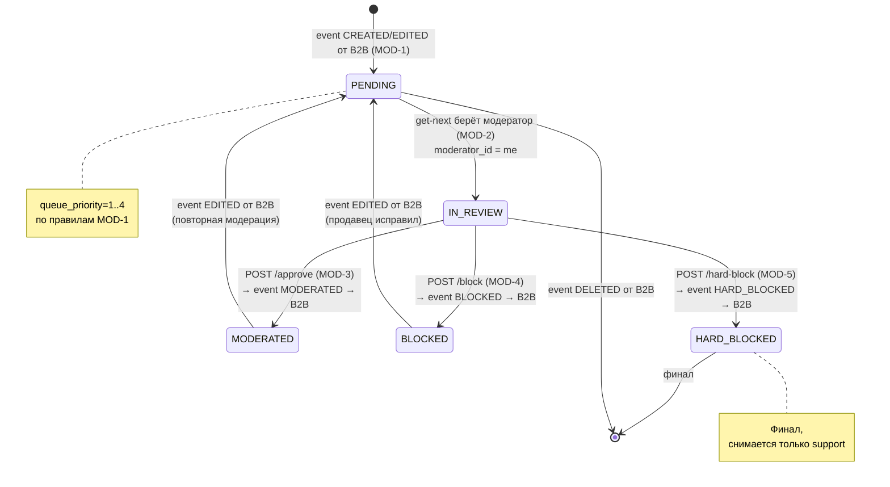

# Moderation Flows -- полная спецификация


> **Соглашения**: все ID -- UUID (string, format: uuid). Все даты -- ISO 8601. Цены -- integer в копейках. Поля JSON -- snake_case. Поля БД -- snake_case. Межсервисная аутентификация -- заголовок `X-Service-Key`.

---

## Таблица `product_moderation` (полная schema)

| Поле | Тип | Ограничения | Описание |
|------|-----|-------------|----------|
| `id` | `uuid` | PK, default `gen_random_uuid()` | Идентификатор записи |
| `product_id` | `uuid` | UNIQUE, NOT NULL | ID товара в B2B (one-to-one) |
| `seller_id` | `uuid` | NOT NULL | ID продавца (из события B2B) |
| `status` | `varchar` | NOT NULL | `PENDING`, `IN_REVIEW`, `MODERATED`, `BLOCKED`, `HARD_BLOCKED` |
| `queue_priority` | `integer` | NOT NULL, CHECK (1..4) | Номер очереди: 1-4 (вычисляется при обработке события) |
| `json_before` | `jsonb` | nullable | Состояние товара ДО изменений (`null` для новых) |
| `json_after` | `jsonb` | NOT NULL | Текущее состояние товара (GET /api/v1/products/{id} из B2B) |
| `blocking_reason_id` | `uuid` | nullable, FK -> `product_blocking_reasons.id` | Причина блокировки |
| `moderator_id` | `uuid` | nullable | ID модератора, взявшего карточку (get-next) или принявшего решение |
| `moderator_comment` | `text` | nullable | Общий комментарий при блокировке |
| `date_created` | `timestamp` | NOT NULL, default `now()` | Дата создания записи |
| `date_updated` | `timestamp` | NOT NULL, default `now()` | Дата последнего обновления (при каждом событии от B2B) |
| `date_moderation` | `timestamp` | nullable | Дата последнего решения модератора |

### Moderation card lifecycle (state machine)



### Формат `json_after` (= GET /api/v1/products/{id} из B2B)

`json_after` хранит снимок ответа B2B endpoint `GET /api/v1/products/{product_id}`. Формат определен в `b2b-flows.md`, flow B2B-5.

### Обработка приватных полей продавца

**cost_price и reserved_quantity НЕ сохраняются в json_after.**

При получении Product из B2B (GET /api/v1/products/{id}), Moderation удаляет эти поля перед сохранением в `json_after`:

```python
def strip_private_fields(product_data: dict) -> dict:
    product_data = {**product_data}  # shallow copy
    for sku in product_data.get('skus', []):
        sku.pop('cost_price', None)
        sku.pop('reserved_quantity', None)
    return product_data
```

**Обоснование**: модератор оценивает товар по title, description, images, category, characteristics -- цена и себестоимость не нужны для модерации, а их видимость нарушает коммерческую тайну продавца.

```json
{
  "id": "a1b2c3d4-e5f6-7890-abcd-ef1234567890",
  "title": "iPhone 15 Pro Max",
  "description": "Флагманский смартфон Apple 2024 года с чипом A17 Pro",
  "status": "ON_MODERATION",
  "deleted": false,
  "blocked": false,
  "category": {
    "id": "f47ac10b-58cc-4372-a567-0e02b2c3d479",
    "name": "iOS"
  },
  "images": [
    { "url": "/s3/iphone15-front.jpg", "ordering": 0 },
    { "url": "/s3/iphone15-back.jpg", "ordering": 1 }
  ],
  "characteristics": [
    { "name": "Бренд", "value": "Apple" },
    { "name": "Страна-производитель", "value": "Китай" }
  ],
  "skus": [
    {
      "id": "b2c3d4e5-f6a7-8901-bcde-f12345678901",
      "name": "256GB Black",
      "price": 12999000,
      "discount": 0,
      "image": "/s3/iphone15-black-256.jpg",
      "active_quantity": 10,
      "characteristics": [
        { "name": "Цвет", "value": "Чёрный" },
        { "name": "Объём памяти", "value": "256 ГБ" }
      ]
    }
  ],
  "blocking_reason": null,
  "field_reports": []
}
```

> **Ранее содержавшиеся ошибки (v1)**: `json_after` включал `characteristics_values`, `productImages` (как поле объекта), `article` -- этих полей нет в B2B Product response. Исправлено: формат строго соответствует GET /api/v1/products/{id}.

### Таблица `product_moderation_field_report`

| Поле | Тип | Ограничения | Описание |
|------|-----|-------------|----------|
| `id` | `uuid` | PK, default `gen_random_uuid()` | Идентификатор |
| `product_moderation_id` | `uuid` | FK -> `product_moderation.id`, NOT NULL, ON DELETE CASCADE | Ссылка на запись модерации |
| `field_name` | `varchar` | NOT NULL | Допустимые значения: `title`, `description`, `product_images`, `category`, `sku_name`, `sku_image`, `sku_price` |
| `sku_id` | `uuid` | nullable | ID конкретного SKU (null = замечание к товару, не к SKU) |
| `comment` | `text` | NOT NULL | Комментарий модератора |
| `date_created` | `timestamp` | NOT NULL, default `now()` | Дата создания |

> **field_name**: в БД и в JSON API одинаково -- snake_case. Допустимые значения: `title`, `description`, `product_images`, `category`, `sku_name`, `sku_image`, `sku_price`.

### Таблица `product_blocking_reasons` (seed)

| Поле | Тип | Ограничения | Описание |
|------|-----|-------------|----------|
| `id` | `uuid` | PK, default `gen_random_uuid()` | Идентификатор |
| `title` | `varchar` | NOT NULL | Текст причины блокировки |
| `hard_block` | `boolean` | NOT NULL, default `false` | `true` = перманентная блокировка |

### Статусы `product_moderation.status`

```
PENDING ──► IN_REVIEW ──► MODERATED
                    └──► BLOCKED ──► (EDITED) ──► PENDING
                    └──► HARD_BLOCKED (terminal)

MODERATED ──► (EDITED) ──► PENDING
```

- **PENDING** -- в очереди, ждет модератора
- **IN_REVIEW** -- модератор взял карточку (get-next), назначен `moderator_id`
- **MODERATED** -- одобрен
- **BLOCKED** -- мягкая блокировка, продавец может исправить
- **HARD_BLOCKED** -- перманентная блокировка, терминальный статус

> **HARD_BLOCKED -- бизнес-терминальный статус.** Продавец НЕ может редактировать товар, модератор НЕ может снять блокировку в штатном flow. Только суперадмин через Django Admin может вручную вернуть в PENDING в аварийных случаях (ошибочная блокировка, подтверждённая апелляция). Это data-fix с обязательным audit log и комментарием причины, НЕ штатный бизнес-процесс.

### 4 очереди приоритизации

| queue_priority | Название | SQL-условие | Сортировка |
|----------------|----------|-------------|------------|
| 1 | Новые товары | `status = 'PENDING' AND date_moderation IS NULL` | `date_updated ASC` |
| 2 | Исправленные после блокировки | `status = 'PENDING' AND date_moderation IS NOT NULL AND blocking_reason_id IS NOT NULL` | `date_updated ASC` |
| 3 | Изменённые, в наличии | `status = 'PENDING' AND date_moderation IS NOT NULL AND blocking_reason_id IS NULL AND total_active_quantity > 0` | `date_updated ASC` |
| 4 | Изменённые, не в наличии | `status = 'PENDING' AND date_moderation IS NOT NULL AND blocking_reason_id IS NULL AND total_active_quantity = 0` | `date_updated ASC` |

> `total_active_quantity` -- сумма `activeQuantity` по всем SKU товара. Вычисляется из `json_after` при обработке события. Может храниться в отдельном поле `product_moderation.total_active_quantity` для скорости запросов.

---

<a name="receive-product-events"></a>
## Flow MOD-1: Получение события от B2B

B2B отправляет событие при создании, изменении или удалении товара продавцом.

### Endpoint

```
POST /api/v1/events/product
```

### Request

Формат определен в `events-schema.md`, раздел "B2B -> Moderation".

```json
{
  "product_id": "a1b2c3d4-e5f6-7890-abcd-ef1234567890",
  "seller_id": "c3d4e5f6-a7b8-9012-cdef-123456789012",
  "event": "CREATED",
  "date": "2026-03-15T14:30:00.000Z"
}
```

| Поле | Тип | Обязательное | Описание |
|------|-----|:---:|----------|
| `product_id` | string (uuid) | да | ID товара в B2B |
| `seller_id` | string (uuid) | да | ID продавца |
| `event` | string (enum) | да | `CREATED`, `EDITED`, `DELETED` |
| `date` | string (ISO 8601) | да | Время события в B2B |

### Аутентификация

```
X-Service-Key: {b2b_to_mod_key}
```

Без валидного ключа -- 401 Unauthorized.

### Response

- **200 OK** -- событие принято
- **400 Bad Request** -- невалидный формат или бизнес-ошибка (дубль CREATED и т.п.)
- **401 Unauthorized** -- невалидный или отсутствующий `X-Service-Key`

### Логика обработки

#### CREATED

```
1. Проверить X-Service-Key → 401 если невалидный
2. Найти запись в product_moderation по product_id
3. Если найдена и status = HARD_BLOCKED → игнорировать (200 OK)
4. Если найдена → 400 Bad Request (дубль CREATED)
5. GET {b2b_url}/api/v1/products/{product_id}
   Headers: X-Service-Key: {mod_to_b2b_key}
6. Если B2B вернул ошибку → 500 (retry от B2B)
7. INSERT product_moderation:
   - id = gen_random_uuid()
   - product_id = product_id
   - seller_id = seller_id
   - json_before = null
   - json_after = ответ GET product
   - status = PENDING
   - queue_priority = 1
   - date_created = now()
   - date_updated = now()
8. Ответить 200 OK
```

#### EDITED

```
1. Проверить X-Service-Key → 401 если невалидный
2. Найти запись в product_moderation по product_id
3. Если не найдена → 400 Bad Request
4. Если status = HARD_BLOCKED → игнорировать (200 OK)
5. Запомнить old_status = текущий status
6. GET {b2b_url}/api/v1/products/{product_id}
   Headers: X-Service-Key: {mod_to_b2b_key}
7. Если B2B вернул ошибку → 500 (retry от B2B)
8. UPDATE product_moderation:
   - json_before = текущий json_after
   - json_after = ответ GET product
   - status = PENDING
   - queue_priority = вычислить:
     - если old_status = BLOCKED → queue_priority = 2
     - если old_status = MODERATED и total_active_quantity > 0 → 3
     - если old_status = MODERATED и total_active_quantity = 0 → 4
     - иначе (PENDING/IN_REVIEW -- повторный EDITED) → сохранить текущий
   - date_updated = now()
   - moderator_id = null (сбросить, карточка снова в очереди)
9. DELETE field_reports по product_moderation_id (CASCADE или явный DELETE)
10. Ответить 200 OK
```

#### DELETED

```
1. Проверить X-Service-Key → 401 если невалидный
2. Найти запись в product_moderation по product_id
3. Если не найдена → 200 OK (идемпотентно)
4. DELETE запись (CASCADE удалит field_reports)
   - Запись с HARD_BLOCKED тоже удаляется при DELETED
5. Ответить 200 OK
```

### Идемпотентность

Рекомендуется дедупликация по паре `(product_id, date)`. Если событие с более старой или равной датой уже обработано -- игнорировать (200 OK). Подробнее -- `events-schema.md`, раздел "Retry и идемпотентность".

### Sequence diagram

```
B2B                          Moderation                    B2B (API)
 │                               │                            │
 │  POST /events/product         │                            │
 │  X-Service-Key: {b2b_to_mod}  │                            │
 │  {product_id, event:CREATED}   │                            │
 │ ─────────────────────────────►│                            │
 │                               │  GET /products/{id}        │
 │                               │  X-Service-Key: {mod_to_b2b}│
 │                               │ ──────────────────────────►│
 │                               │  {product data}            │
 │                               │ ◄──────────────────────────│
 │                               │                            │
 │                               │  INSERT product_moderation │
 │                               │  json_before=null          │
 │                               │  json_after={product data} │
 │                               │  status=PENDING            │
 │  200 OK                       │                            │
 │ ◄─────────────────────────────│                            │
```

---

<a name="get-next-card"></a>
## Flow MOD-2: Получение карточки из очереди (get-next)

Модератор запрашивает следующую карточку для проверки.

### Endpoint

```
POST /api/v1/product-moderation/get-next
```

### Request

```json
{
  "queueId": 1
}
```

| Поле | Тип | Обязательное | Описание |
|------|-----|:---:|----------|
| `queueId` | integer (1-4) | нет | Номер очереди. Если не указан или null -- автоприоритизация: перебор 1→2→3→4, возвращается первая непустая |

### Логика

```sql
-- Внутри транзакции:
BEGIN;

SELECT pm.*
FROM product_moderation pm
WHERE pm.status = 'PENDING'
  AND pm.queue_priority = :queueId        -- или перебор 1→4 при автоприоритизации
ORDER BY pm.date_updated ASC
LIMIT 1
FOR UPDATE SKIP LOCKED;

-- Если строка найдена:
UPDATE product_moderation
SET status = 'IN_REVIEW',
    moderator_id = :current_moderator_id,
    date_updated = now()
WHERE id = :found_id;

COMMIT;
```

> **SELECT FOR UPDATE SKIP LOCKED** -- если строка заблокирована другой транзакцией, она пропускается. Два модератора не получат одну карточку.

### Response 200

**Новый товар (очередь 1):**

```json
{
  "product_moderation_id": "e5f6a7b8-9012-3456-cdef-678901234567",
  "product_id": "a1b2c3d4-e5f6-7890-abcd-ef1234567890",
  "seller_id": "c3d4e5f6-a7b8-9012-cdef-123456789012",
  "status": "IN_REVIEW",
  "queue_priority": 1,
  "json_before": null,
  "json_after": {
    "id": "a1b2c3d4-e5f6-7890-abcd-ef1234567890",
    "title": "Кроссовки Nike Air Max",
    "description": "Мужские кроссовки для бега",
    "status": "ON_MODERATION",
    "deleted": false,
    "blocked": false,
    "category": {
      "id": "f47ac10b-58cc-4372-a567-0e02b2c3d479",
      "name": "Обувь"
    },
    "images": [
      { "url": "/s3/products/nike-airmax-1.jpg", "ordering": 0 }
    ],
    "characteristics": [
      { "name": "Бренд", "value": "Nike" }
    ],
    "skus": [
      {
        "id": "b2c3d4e5-f6a7-8901-bcde-f12345678901",
        "name": "Air Max 42",
        "price": 1299000,
        "discount": 0,
        "image": "/s3/skus/nike-airmax-42.jpg",
        "active_quantity": 0,
        "characteristics": [
          { "name": "Цвет", "value": "Чёрный" },
          { "name": "Размер", "value": "42" }
        ]
      }
    ],
    "blocking_reason": null,
    "field_reports": []
  },
  "blocking_history": null,
  "date_created": "2026-03-01T10:00:00.000Z",
  "date_updated": "2026-03-01T10:00:00.000Z"
}
```

**Исправленный после блокировки (очередь 2)** -- `blocking_history` заполнен:

```json
{
  "product_moderation_id": "d4e5f6a7-b890-1234-cdef-567890123456",
  "product_id": "c3d4e5f6-a7b8-9012-cdef-234567890123",
  "seller_id": "e5f6a7b8-9012-3456-cdef-678901234567",
  "status": "IN_REVIEW",
  "queue_priority": 2,
  "json_before": {
    "id": "c3d4e5f6-a7b8-9012-cdef-234567890123",
    "title": "iPhone 15 Pro",
    "description": "Оригинальный смартфон Apple",
    "status": "BLOCKED",
    "deleted": false,
    "blocked": true,
    "category": { "id": "f47ac10b-58cc-4372-a567-0e02b2c3d479", "name": "iOS" },
    "images": [{ "url": "/s3/iphone15-old.jpg", "ordering": 0 }],
    "characteristics": [{ "name": "Бренд", "value": "Apple" }],
    "skus": [
      {
        "id": "a7b8c9d0-1234-5678-ef01-890123456789",
        "name": "256GB Black",
        "price": 12999000,
        "discount": 0,
        "image": "/s3/iphone15-black-old.jpg",
        "active_quantity": 0,
        "characteristics": [
          { "name": "Цвет", "value": "Чёрный" },
          { "name": "Объём памяти", "value": "256 ГБ" }
        ]
      }
    ],
    "blocking_reason": {
      "id": "b8c9d0e1-2345-6789-f012-901234567890",
      "title": "Описание не соответствует товару",
      "comment": "Фото другой модели"
    },
    "field_reports": [
      {
        "field_name": "product_images",
        "sku_id": null,
        "comment": "На фото iPhone 14, а не iPhone 15 Pro"
      }
    ]
  },
  "json_after": {
    "id": "c3d4e5f6-a7b8-9012-cdef-234567890123",
    "title": "iPhone 15 Pro",
    "description": "Оригинальный смартфон Apple. Обновленное описание.",
    "status": "ON_MODERATION",
    "deleted": false,
    "blocked": false,
    "category": { "id": "f47ac10b-58cc-4372-a567-0e02b2c3d479", "name": "iOS" },
    "images": [{ "url": "/s3/iphone15-new.jpg", "ordering": 0 }],
    "characteristics": [{ "name": "Бренд", "value": "Apple" }],
    "skus": [
      {
        "id": "a7b8c9d0-1234-5678-ef01-890123456789",
        "name": "256GB Black",
        "price": 12999000,
        "discount": 0,
        "image": "/s3/iphone15-black-new.jpg",
        "active_quantity": 0,
        "characteristics": [
          { "name": "Цвет", "value": "Чёрный" },
          { "name": "Объём памяти", "value": "256 ГБ" }
        ]
      }
    ],
    "blocking_reason": null,
    "field_reports": []
  },
  "blocking_history": {
    "blocking_reason": {
      "id": "b8c9d0e1-2345-6789-f012-901234567890",
      "title": "Описание не соответствует товару"
    },
    "moderator_comment": "Фото другой модели",
    "field_reports": [
      {
        "field_name": "product_images",
        "sku_id": null,
        "comment": "На фото iPhone 14, а не iPhone 15 Pro"
      }
    ],
    "date_blocked": "2026-03-02T09:15:00.000Z"
  },
  "date_created": "2026-03-02T08:00:00.000Z",
  "date_updated": "2026-03-04T11:30:00.000Z"
}
```

### Response 204

Очередь пуста -- нет карточек для модерации.

### Response 400

Невалидный `queueId` (не 1-4).

---

<a name="approve-product"></a>
## Flow MOD-3: Одобрение товара

### Endpoint

```
POST /api/v1/products/{product_id}/approve
```

### Path Parameters

| Параметр | Тип | Описание |
|----------|-----|----------|
| `product_id` | string (uuid) | ID товара в B2B |

### Request

Тело запроса опционально:

```json
{
  "moderator_comment": "Товар соответствует требованиям"
}
```

| Поле | Тип | Обязательное | Описание |
|------|-----|:---:|----------|
| `moderator_comment` | string | нет | Комментарий модератора (для внутренних записей) |

### Предусловия

1. Карточка существует в `product_moderation`
2. `status = IN_REVIEW` (модератор должен сначала взять карточку через get-next)
3. `moderator_id = текущий модератор` (нельзя одобрить чужую карточку)
4. `status != HARD_BLOCKED`

### Логика

```
1. Найти запись в product_moderation по product_id
2. Если не найдена → 404
3. Если status = HARD_BLOCKED → 409 Conflict ("Product is permanently blocked")
4. Если status != IN_REVIEW → 409 Conflict ("Product is not in review")
5. Если moderator_id != текущий модератор → 403 Forbidden ("Not assigned to you")
6. Опционально: GET {b2b_url}/api/v1/products/{product_id} -- проверить,
   что товар не изменился критически (SKU не удалены)
   - Если у товара 0 SKU → 409 Conflict ("Product has no SKUs, cannot approve")
7. UPDATE product_moderation:
   - status = MODERATED
   - date_moderation = now()
   - moderator_comment = из запроса (или null)
   - blocking_reason_id = null (очистить)
8. DELETE field_reports по product_moderation_id (очистить)
9. Отправить событие в B2B:
   POST {b2b_url}/api/v1/events/moderation
   Headers: X-Service-Key: {mod_to_b2b_key}
   Body: { "product_id": "...", "status": "MODERATED" }
10. Если B2B вернул ошибку → логировать, 500 модератору
    (status остается IN_REVIEW, модератор повторяет)
11. Ответить 200 OK
```

### Response 200

```json
{
  "product_id": "a1b2c3d4-e5f6-7890-abcd-ef1234567890",
  "status": "MODERATED"
}
```

### Response 403

```json
{
  "error": "This moderation card is not assigned to you"
}
```

### Response 404

```json
{
  "error": "Product not found in moderation queue"
}
```

### Response 409

```json
{
  "error": "Product is not in review status"
}
```

или

```json
{
  "error": "Product has no SKUs, cannot approve"
}
```

### Исходящее событие (Moderation -> B2B)

Формат определен в `events-schema.md`, раздел "Событие MODERATED".

```
POST {b2b_url}/api/v1/events/moderation
Content-Type: application/json
X-Service-Key: {mod_to_b2b_key}
```

```json
{
  "product_id": "a1b2c3d4-e5f6-7890-abcd-ef1234567890",
  "status": "MODERATED"
}
```

B2B при получении:
- `product.status` -> `MODERATED`
- `product.blocked` -> `false`
- Товар становится доступен в каталоге (при наличии SKU с `activeQuantity > 0`)

### Sequence diagram

```
Модератор            Moderation                    B2B
    │                    │                           │
    │  POST /approve     │                           │
    │ ──────────────────►│                           │
    │                    │  CHECK: status=IN_REVIEW   │
    │                    │  CHECK: moderator_id=me    │
    │                    │                           │
    │                    │  UPDATE status=MODERATED   │
    │                    │  DELETE field_reports       │
    │                    │                           │
    │                    │  POST /events/moderation   │
    │                    │  X-Service-Key: {mod_to_b2b}
    │                    │  {status: MODERATED}       │
    │                    │ ─────────────────────────►│
    │                    │                           │  status → MODERATED
    │                    │            200 OK         │  blocked = false
    │                    │ ◄─────────────────────────│
    │  200 OK            │                           │
    │ ◄──────────────────│                           │
```

---

<a name="soft-block"></a>
## Flow MOD-4: Мягкая блокировка

### Endpoint

```
POST /api/v1/products/{product_id}/decline
```

### Path Parameters

| Параметр | Тип | Описание |
|----------|-----|----------|
| `product_id` | string (uuid) | ID товара в B2B |

### Request

```json
{
  "blocking_reason_id": "a7b8c9d0-1234-5678-ef01-890123456789",
  "moderator_comment": "Описание и фото не соответствуют товару",
  "field_reports": [
    {
      "field_name": "description",
      "sku_id": null,
      "comment": "Текст описания скопирован с другого товара"
    },
    {
      "field_name": "sku_price",
      "sku_id": "b2c3d4e5-f6a7-8901-bcde-f12345678901",
      "comment": "Цена подозрительно низкая для данного бренда"
    },
    {
      "field_name": "product_images",
      "sku_id": null,
      "comment": "Фото низкого качества, товар не виден"
    }
  ]
}
```

| Поле | Тип | Обязательное | Описание |
|------|-----|:---:|----------|
| `blocking_reason_id` | string (uuid) | да | ID из справочника `product_blocking_reasons` |
| `moderator_comment` | string (max 1000) | да | Общий комментарий модератора |
| `field_reports` | FieldReport[] | нет (default `[]`) | Замечания по конкретным полям |
| `field_reports[].field_name` | string (enum) | да | Допустимые: `title`, `description`, `product_images`, `category`, `sku_name`, `sku_image`, `sku_price` |
| `field_reports[].sku_id` | string (uuid) / null | нет | ID конкретного SKU. `null` = замечание к товару |
| `field_reports[].comment` | string (max 500) | да | Комментарий по полю |

### Предусловия

1. Карточка существует в `product_moderation`
2. `status = IN_REVIEW` (модератор должен сначала взять карточку через get-next)
3. `moderator_id = текущий модератор` (нельзя заблокировать чужую карточку)
4. `status != HARD_BLOCKED`
5. Причина с `blocking_reason_id` имеет `hard_block = false` (иначе это Flow MOD-5)

### Логика

```
1. Найти запись в product_moderation по product_id
2. Если не найдена → 404
3. Если status = HARD_BLOCKED → 409 Conflict
4. Если status != IN_REVIEW → 409 Conflict ("Product is not in review")
5. Если moderator_id != текущий модератор → 403 Forbidden ("Not assigned to you")
6. Загрузить blocking_reason по blocking_reason_id
7. Если не найдена → 400 Bad Request ("Blocking reason not found")
8. Если blocking_reason.hard_block = true → перейти к Flow MOD-5
9. UPDATE product_moderation:
   - status = BLOCKED
   - date_moderation = now()
   - blocking_reason_id = blocking_reason_id
   - moderator_comment = moderator_comment
10. DELETE старые field_reports (если есть)
11. INSERT field_reports из запроса:
    - id = gen_random_uuid()
    - product_moderation_id = id записи
    - field_name = field_name (маппинг camelCase → snake_case)
    - sku_id = sku_id
    - comment = comment
12. Отправить событие в B2B:
    POST {b2b_url}/api/v1/events/moderation
    Headers: X-Service-Key: {mod_to_b2b_key}
13. Ответить 200 OK
```

### Response 200

```json
{
  "product_id": "a1b2c3d4-e5f6-7890-abcd-ef1234567890",
  "status": "BLOCKED"
}
```

### Response 403

```json
{
  "error": "This moderation card is not assigned to you"
}
```

### Исходящее событие (Moderation -> B2B)

Формат определен в `events-schema.md`, раздел "Событие BLOCKED".

```
POST {b2b_url}/api/v1/events/moderation
Content-Type: application/json
X-Service-Key: {mod_to_b2b_key}
```

```json
{
  "product_id": "a1b2c3d4-e5f6-7890-abcd-ef1234567890",
  "status": "BLOCKED",
  "hard_block": false,
  "blocking_reason": {
    "id": "a7b8c9d0-1234-5678-ef01-890123456789",
    "title": "Описание не соответствует товару",
    "comment": "Описание и фото не соответствуют товару"
  },
  "field_reports": [
    {
      "field_name": "description",
      "sku_id": null,
      "comment": "Текст описания скопирован с другого товара"
    },
    {
      "field_name": "sku_price",
      "sku_id": "b2c3d4e5-f6a7-8901-bcde-f12345678901",
      "comment": "Цена подозрительно низкая для данного бренда"
    },
    {
      "field_name": "product_images",
      "sku_id": null,
      "comment": "Фото низкого качества, товар не виден"
    }
  ]
}
```

B2B при получении:
- `product.status` -> `BLOCKED`
- `product.blocked` -> `true`
- Сохраняет `blocking_reason` и `field_reports` для отображения продавцу

### Sequence diagram

```
Модератор            Moderation                    B2B                 Продавец
    │                    │                           │                     │
    │  POST /decline     │                           │                     │
    │  {reason, reports} │                           │                     │
    │ ──────────────────►│                           │                     │
    │                    │  CHECK: status=IN_REVIEW   │                     │
    │                    │  CHECK: moderator_id=me    │                     │
    │                    │  CHECK: hard_block=false   │                     │
    │                    │                           │                     │
    │                    │  UPDATE status=BLOCKED     │                     │
    │                    │  INSERT field_reports      │                     │
    │                    │                           │                     │
    │                    │  POST /events/moderation   │                     │
    │                    │  {BLOCKED, reason, reports}│                     │
    │                    │ ─────────────────────────►│                     │
    │                    │                           │  status → BLOCKED    │
    │                    │                           │  blocked = true      │
    │                    │            200 OK         │                     │
    │                    │ ◄─────────────────────────│                     │
    │  200 OK            │                           │                     │
    │ ◄──────────────────│                           │                     │
    │                    │                           │                     │
    │                    │                           │  Продавец видит     │
    │                    │                           │  причину + reports  │
    │                    │                           │ ───────────────────►│
    │                    │                           │                     │
    │                    │                           │  PUT /products/{id} │
    │                    │                           │ ◄────────────────── │
    │                    │                           │  status→ON_MODERATION
    │                    │  POST /events/product     │                     │
    │                    │  {event: EDITED}          │                     │
    │                    │ ◄─────────────────────────│                     │
    │                    │  → Flow MOD-1 (EDITED)    │                     │
    │                    │  → queue_priority = 2     │                     │
```

---

<a name="hard-block"></a>
## Flow MOD-5: Жёсткая блокировка

Тот же endpoint, что и MOD-4. Определяется по `hard_block` причины блокировки.

### Endpoint

```
POST /api/v1/products/{product_id}/decline
```

### Request

```json
{
  "blocking_reason_id": "b8c9d0e1-2345-6789-f012-901234567890",
  "moderator_comment": "Товар является контрафактом, подтверждено проверкой",
  "field_reports": []
}
```

Причина `blocking_reason_id` ссылается на запись с `hard_block = true` (seed: "Контрафактный товар").

### Предусловия

Аналогично MOD-4 (проверки status, moderator_id), кроме:
- Причина с `blocking_reason_id` имеет `hard_block = true`

### Логика

```
1-5. Аналогично MOD-4 (проверки X-Service-Key, status, moderator_id)
6. Загрузить blocking_reason по blocking_reason_id
7. blocking_reason.hard_block = true
8. UPDATE product_moderation:
   - status = HARD_BLOCKED  (НЕ BLOCKED)
   - date_moderation = now()
   - blocking_reason_id = blocking_reason_id
   - moderator_comment = moderator_comment
9. DELETE старые field_reports
10. INSERT field_reports (если есть)
11. Отправить событие в B2B:
    POST {b2b_url}/api/v1/events/moderation
    Headers: X-Service-Key: {mod_to_b2b_key}
12. Ответить 200 OK
```

### Response 200

```json
{
  "product_id": "a1b2c3d4-e5f6-7890-abcd-ef1234567890",
  "status": "HARD_BLOCKED"
}
```

### Исходящее событие (Moderation -> B2B)

Формат определен в `events-schema.md`, раздел "Событие BLOCKED" (жёсткая блокировка).

```json
{
  "product_id": "a1b2c3d4-e5f6-7890-abcd-ef1234567890",
  "status": "BLOCKED",
  "hard_block": true,
  "blocking_reason": {
    "id": "b8c9d0e1-2345-6789-f012-901234567890",
    "title": "Контрафактный товар",
    "comment": "Товар является контрафактом, подтверждено проверкой"
  },
  "field_reports": []
}
```

B2B при получении:
- `product.status` -> `HARD_BLOCKED`
- `product.blocked` -> `true`
- Товар нельзя редактировать, PUT /products/{id} отклоняется (403)
- Повторная отправка на модерацию невозможна
- Если есть активные резервы -- B2B отправляет событие `PRODUCT_BLOCKED` в B2C

### Каскад B2B -> B2C при жёсткой блокировке

Формат определен в `events-schema.md`, раздел "Событие PRODUCT_BLOCKED".

```
POST {b2c_url}/api/v1/events/product
X-Service-Key: {b2b_to_b2c_key}
```

```json
{
  "event": "PRODUCT_BLOCKED",
  "product_id": "a1b2c3d4-e5f6-7890-abcd-ef1234567890",
  "sku_ids": [
    "b2c3d4e5-f6a7-8901-bcde-f12345678901",
    "c3d4e5f6-a7b8-9012-cdef-234567890123"
  ],
  "date": "2026-03-15T14:30:00.000Z"
}
```

B2C при получении: помечает товары в корзине как unavailable, wishlist показывает "Товар недоступен".

### Необратимость

- `HARD_BLOCKED` -- терминальный статус в Moderation
- События EDITED для товара в `HARD_BLOCKED` игнорируются (200 OK)
- Событие DELETED удаляет запись из Moderation (товар остается заблокированным в B2B)
- Фронтенд Moderation не показывает HARD_BLOCKED товары в очередях

---

<a name="blocking-reasons"></a>
## Flow MOD-6: Справочник причин блокировки

### Endpoint

```
GET /api/v1/product-blocking-reasons
```

### Response 200

```json
[
  { "id": "a7b8c9d0-1234-5678-ef01-890123456789", "title": "Описание не соответствует товару", "hard_block": false },
  { "id": "b8c9d0e1-2345-6789-f012-901234567890", "title": "Изображение не соответствует товару", "hard_block": false },
  { "id": "c9d0e1f2-3456-7890-0123-012345678901", "title": "Некорректная категория товара", "hard_block": false },
  { "id": "d0e1f2a3-4567-8901-1234-123456789012", "title": "Недостаточно информации о товаре", "hard_block": false },
  { "id": "e1f2a3b4-5678-9012-2345-234567890123", "title": "Нецензурные или оскорбительные материалы", "hard_block": false },
  { "id": "f2a3b4c5-6789-0123-3456-345678901234", "title": "Дублирование существующего товара", "hard_block": false },
  { "id": "a3b4c5d6-7890-1234-4567-456789012345", "title": "Некорректная цена", "hard_block": false },
  { "id": "b4c5d6e7-8901-2345-5678-567890123456", "title": "Контрафактный товар", "hard_block": true },
  { "id": "c5d6e7f8-9012-3456-6789-678901234567", "title": "Товар запрещён к продаже на территории РФ", "hard_block": true },
  { "id": "d6e7f8a9-0123-4567-7890-789012345678", "title": "Товар нарушает авторские права", "hard_block": true }
]
```

| Поле | Тип | Описание |
|------|-----|----------|
| `id` | string (uuid) | ID причины |
| `title` | string | Текст причины |
| `hard_block` | boolean | `true` = перманентная блокировка, `false` = мягкая |

Данные seed, не меняются в runtime.

---

## Edge Cases

### 1. Два модератора одновременно запрашивают get-next

**Проблема**: два модератора вызывают get-next одновременно, оба хотят из очереди 1.

**Решение**: `SELECT FOR UPDATE SKIP LOCKED`.

```
Модератор A: SELECT ... FOR UPDATE SKIP LOCKED → получает карточку product_id=aaa...
Модератор B: SELECT ... FOR UPDATE SKIP LOCKED → aaa... заблокирована → пропускает → получает bbb...
```

Строка, захваченная транзакцией A, невидима для B. Каждый получает свою карточку.

**Реализация** (рекомендуемая): `status = IN_REVIEW` ставится в той же транзакции, COMMIT сразу. Таймаут: cron/celery проверяет записи со статусом IN_REVIEW старше N минут, возвращает в PENDING.

### 2. Товар изменился (EDITED) во время review

**Проблема**: модератор взял карточку (status=IN_REVIEW), а продавец тем временем изменил товар, пришло событие EDITED.

**Решение**:
```
1. Событие EDITED обновляет json_before, json_after, date_updated
2. status → PENDING (сбрасывается из IN_REVIEW)
3. moderator_id → null
4. Модератор при попытке approve/decline получает 409 Conflict:
   "Товар был изменён во время проверки"
5. Фронтенд показывает уведомление и кнопку "Обновить"
```

Проверка при approve/decline:
```sql
-- Перед обновлением проверяем, что карточка всё ещё IN_REVIEW у этого модератора
WHERE product_id = :product_id
  AND status = 'IN_REVIEW'
  AND moderator_id = :current_moderator_id
```

Если 0 строк обновлено -- 409 Conflict.

### 3. Товар удалён (DELETED) пока в очереди или на review

**Проблема**: товар в статусе PENDING или IN_REVIEW, приходит событие DELETED.

**Решение**:
```
1. Удалить запись из product_moderation (CASCADE → field_reports)
2. Если модератор уже смотрит карточку:
   - approve/decline вернёт 404 (запись удалена)
   - Фронтенд: "Товар был удалён продавцом"
3. Модератор автоматически переходит к get-next
```

### 4. hard_block товара с активными заказами в B2C

**Проблема**: товар заблокирован жёстко, но в B2C есть активные заказы с этим SKU.

**Решение** (на стороне B2B/B2C, не Moderation):
```
1. Moderation отправляет {status: BLOCKED, hard_block: true} в B2B
2. B2B ставит status=HARD_BLOCKED, blocked=true
3. B2B отправляет событие PRODUCT_BLOCKED в B2C (см. events-schema.md)
4. B2C:
   - Существующие заказы (PAID, ASSEMBLING) -- продолжают обработку
     (цены зафиксированы в order_items, резервы сохраняются)
   - Новые заказы невозможны (товар скрыт из каталога)
   - Корзина: SKU помечаются как unavailable
   - Wishlist: "Товар недоступен"
```

Moderation не знает о заказах в B2C. Каскад обрабатывается на уровне B2B -> B2C.

### 5. Модератор одобряет товар без SKU (race с удалением SKU)

**Проблема**: модератор смотрит карточку, в это время продавец удалил все SKU из товара.

**Решение**:
```
1. Перед approve Moderation делает GET {b2b_url}/api/v1/products/{product_id}
2. Если SKU пустой массив → 409 Conflict ("Product has no SKUs, cannot approve")
3. Модератор видит ошибку, перезагружает карточку
4. Альтернативно: approve проходит, но B2B при получении MODERATED
   проверяет наличие SKU и может отклонить (400/409)
```

Рекомендуется первый вариант (проактивная проверка на стороне Moderation).

### 6. Таймаут IN_REVIEW

**Проблема**: модератор взял карточку и не вернулся (закрыл вкладку, ушёл).

**Решение**:
```sql
-- Cron/celery задача, раз в 5 минут:
UPDATE product_moderation
SET status = 'PENDING',
    moderator_id = NULL,
    date_updated = now()
WHERE status = 'IN_REVIEW'
  AND date_updated < now() - interval '30 minutes';
```

Таймаут 30 минут -- достаточно для проверки одной карточки. Значение конфигурируется.

---

## Сводка всех HTTP-вызовов модуля Moderation

### Входящие (Moderation принимает)

| Метод | Путь | Откуда | Описание | Flow |
|-------|------|--------|----------|------|
| POST | `/api/v1/events/product` | B2B | Событие о товаре | MOD-1 |
| POST | `/api/v1/product-moderation/get-next` | Фронтенд | Следующая карточка | MOD-2 |
| POST | `/api/v1/products/{product_id}/approve` | Фронтенд | Одобрение | MOD-3 |
| POST | `/api/v1/products/{product_id}/decline` | Фронтенд | Блокировка | MOD-4, MOD-5 |
| GET | `/api/v1/product-blocking-reasons` | Фронтенд | Справочник причин | MOD-6 |

### Исходящие (Moderation вызывает)

| Метод | Путь | Куда | Описание | Flow |
|-------|------|------|----------|------|
| GET | `/api/v1/products/{product_id}` | B2B | Данные товара для json_after | MOD-1, MOD-3 (опц.) |
| POST | `/api/v1/events/moderation` | B2B | Решение модератора | MOD-3, MOD-4, MOD-5 |

### Аутентификация

| Направление | Ключ | Описание |
|-------------|------|----------|
| B2B -> Moderation | `X-Service-Key: {B2B_TO_MOD_KEY}` | Отправка событий CREATED/EDITED/DELETED |
| Moderation -> B2B (события) | `X-Service-Key: {MOD_TO_B2B_KEY}` | Результат модерации |
| Moderation -> B2B (данные) | `X-Service-Key: {MOD_TO_B2B_KEY}` | GET /products/{id} для json_after |

---

## Changelog

| Версия | Дата | Автор | Изменения |
|--------|------|-------|-----------|
| 1 | 2026-04-16 | demiurge | Первая итерация: MOD-1..MOD-6, edge cases, schema, сводка |
| 2 | 2026-04-16 | demiurge | Полная переработка. Исправлено: (1) все ID теперь UUID, не integer; (2) json_after соответствует GET /products/{id} из B2B -- убраны characteristics_values, productImages как поле объекта, article; (3) добавлена проверка принадлежности при approve/decline (moderator_id = текущий модератор, status = IN_REVIEW); (4) field_name в БД snake_case, в JSON camelCase с явным маппингом; (5) таблицы БД используют UUID PK с gen_random_uuid(). Форматы событий согласованы с events-schema.md и b2b-flows.md от arch |
